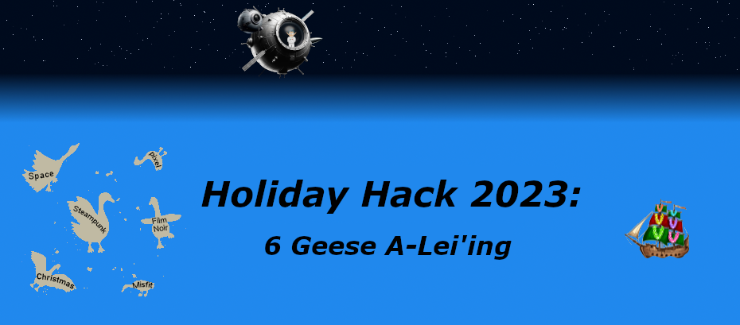
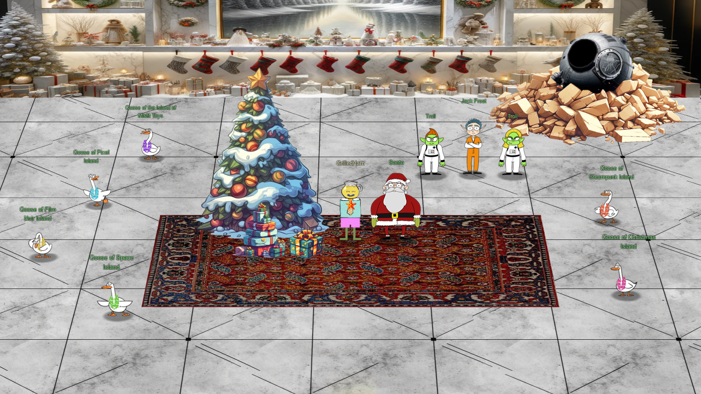

# Welcome

## Introduction

Welcome, reader, to my second [Holiday Hack Challenge](https://2023.holidayhackchallenge.com/) write-up. Each year there seem to be more challenges. This year there were so many that the page limit for the write-up was _doubled_! With so much information to keep track of, the [write-up template](https://github.com/crahan/HolidayHackChallengeTemplate/) provided by Thomas Bouve was an enormous help this year. 
Thanks to SANS for creating yet another fun and educational Holiday Hack Challenge.

!!! note "100-page submission limit"
    Each year there's a huge number of write-ups that need to be reviewed by the Counter Hack team. To find a good middle ground between preventing information overload and creating a write-up that can stand on its own as a learning resource, some parts, like the *navigation tip* below, are collapsed by default. Skipping over these will not take away from understanding the overall solution, but feel free to expand them to get some additional information.

??? tip "Navigation tip"
    Even with less than 100 pages, there's still quite a bit of information to read through. To make things a little easier, you can use ++"P"++ or ++","++ to go to the previous section, ++"N"++ or ++"."++ to navigate to the next section, and ++"S"++, ++"F"++, or ++"/"++ to open up the search dialog.

    **TL;DR** if you keep pressing ++"N"++ or ++"."++ from this point forward, you'll hit all the content in the right order! :smile:

## Answers

!!! success "1. Holiday Hack Orientation - :fontawesome-solid-star::fontawesome-regular-star::fontawesome-regular-star::fontawesome-regular-star::fontawesome-regular-star:"
    Dock your boat and [follow Jingle Ringford's instructions](./objectives/orientation.md).

!!! success "2. Snowball Fight - :fontawesome-solid-star::fontawesome-solid-star::fontawesome-regular-star::fontawesome-regular-star::fontawesome-regular-star:"
    [Hack the snowball fight game](./objectives/snowball_fight.md) to beat Santa.

!!! success "3. Linux 101 - :fontawesome-solid-star::fontawesome-regular-star::fontawesome-regular-star::fontawesome-regular-star::fontawesome-regular-star:"
    [Follow the instructions](./objectives/linux_101.md) in the terminal.

!!! success "4. Reportinator - :fontawesome-solid-star::fontawesome-solid-star::fontawesome-regular-star::fontawesome-regular-star::fontawesome-regular-star:"
    Figure out which sections are [AI hallucinations](./objectives/reportinator.md).

!!! success "5. Azure 101 - :fontawesome-solid-star::fontawesome-solid-star::fontawesome-regular-star::fontawesome-regular-star::fontawesome-regular-star:"
    [Follow the instructions](./objectives/azure_101.md) in the terminal.

!!! success "6. Luggage Lock - :fontawesome-solid-star::fontawesome-regular-star::fontawesome-regular-star::fontawesome-regular-star::fontawesome-regular-star:"
    [Pick the luggage lock](./objectives/luggage_lock.md).

!!! success "7. Linux PrivEsc - :fontawesome-solid-star::fontawesome-solid-star::fontawesome-solid-star::fontawesome-regular-star::fontawesome-regular-star:"
    [santa](./objectives/linux_privesc.md)

!!! success "8. Faster Lock Combination - :fontawesome-solid-star::fontawesome-solid-star::fontawesome-regular-star::fontawesome-regular-star::fontawesome-regular-star:"
    [Pick the "Faster" lock](./objectives/faster_lock_combination.md).

!!! success "9. Game Cartridges: Vol 1 - :fontawesome-solid-star::fontawesome-regular-star::fontawesome-regular-star::fontawesome-regular-star::fontawesome-regular-star:"
    [santaconfusedgivingplanetsqrcode](./objectives/game_cartridges_1.md)

!!! success "10. Game Cartridges: Vol 2 - :fontawesome-solid-star::fontawesome-solid-star::fontawesome-solid-star::fontawesome-regular-star::fontawesome-regular-star:"
    [GL0RY](./objectives/game_cartridges_2.md)

!!! success "11. Game Cartridges: Vol 3 - :fontawesome-solid-star::fontawesome-solid-star::fontawesome-solid-star::fontawesome-regular-star::fontawesome-regular-star:"
    [!tom+elf!](./objectives/game_cartridges_3.md)

!!! success "12. Na'an - :fontawesome-solid-star::fontawesome-solid-star::fontawesome-regular-star::fontawesome-regular-star::fontawesome-regular-star:"
    [NaN](./objectives/na_an.md)

!!! success "13. KQL Kraken Hunt - :fontawesome-solid-star::fontawesome-solid-star::fontawesome-regular-star::fontawesome-regular-star::fontawesome-regular-star:"
    [Beware the Cube that Wombles](./objectives/kql_kraken_hunt.md)

!!! success "14. Phish Detection Agency - :fontawesome-solid-star::fontawesome-solid-star::fontawesome-regular-star::fontawesome-regular-star::fontawesome-regular-star:"
    Figure out which emails are [phishing attempts](./objectives/phish_detection_agency.md).

!!! success "15. Hashcat - :fontawesome-solid-star::fontawesome-solid-star::fontawesome-regular-star::fontawesome-regular-star::fontawesome-regular-star:"
    [IluvC4ndyC4nes!](./objectives/hashcat.md)

!!! success "16. Elf Hunt - :fontawesome-solid-star::fontawesome-solid-star::fontawesome-solid-star::fontawesome-regular-star::fontawesome-regular-star:"
    [Click the elves](./objectives/elf_hunt.md) to win the game.

!!! success "17. Certificate SSHenanigans - :fontawesome-solid-star::fontawesome-solid-star::fontawesome-solid-star::fontawesome-solid-star::fontawesome-solid-star:"
    [Gingerbread](./objectives/certificate_sshenanigans.md)

!!! success "18. The Captain's Comms - :fontawesome-solid-star::fontawesome-solid-star::fontawesome-solid-star::fontawesome-solid-star::fontawesome-solid-star:"
    [10426Hz 12/24 12:00](./objectives/the_captains_comms.md)

!!! success "19. Active Directory - :fontawesome-solid-star::fontawesome-solid-star::fontawesome-solid-star::fontawesome-solid-star::fontawesome-regular-star:"
    [InstructionsForEnteringSatelliteGroundStation.txt](./objectives/active_directory.md)

!!! success "20. Space Island Door Access Speaker - :fontawesome-solid-star::fontawesome-solid-star::fontawesome-solid-star::fontawesome-regular-star::fontawesome-regular-star:"
    [And he whispered, 'Now I shall be out of sight; So through the valley and over the height.' And he'll silently take his way.](./objectives/door_access_speaker.md)

!!! success "21. Camera Access - :fontawesome-solid-star::fontawesome-solid-star::fontawesome-solid-star::fontawesome-regular-star::fontawesome-regular-star:"
    [CONQUER HOLIDAY SEASON!](./objectives/camera_access.md)

!!! success "22. Missile Diversion - :fontawesome-solid-star::fontawesome-solid-star::fontawesome-solid-star::fontawesome-solid-star::fontawesome-solid-star:"
    Use [SQL injection and Java object serialization](./objectives/missile_diversion.md) to alter the trajectory of the missile.

!!! success "23. BONUS! Fishing Guide - :fontawesome-solid-star::fontawesome-regular-star::fontawesome-regular-star::fontawesome-regular-star::fontawesome-regular-star:"
    [Catch 20 different fish](./objectives/fishing_guide.md).

!!! success "24. BONUS! Fishing Mastery - :fontawesome-solid-star::fontawesome-solid-star::fontawesome-solid-star::fontawesome-solid-star::fontawesome-regular-star:"
    [Catch all the fish](./objectives/fishing_mastery.md).

## Conclusion

??? Abstract "Story"
    Just sit right back and you’ll hear a tale, 
    A tale of a yuletide trip 
    That started from a tropic port, 
    Aboard this tiny ship 
    Santa and his helpful elves 
    To Geese Islands did go 
    Continuing their merry work 
    O'er sand instead of snow 
    New this year: a shiny tool 
    The elves logged in with glee 
    What makes short work of many tasks? 
    It's ChatNPT. It's ChatNPT 
    From images to APIs 
    This AI made elves glad 
    But motivations were unknown 
    So was it good or bad? 
    Could it be that NPT 
    Was not from off-the-shelf? 
    Though we'll forgive and trust again 
    We'd found a naughty elf 
    This fancy AI tool of ours 
    With all our work remained 
    Not good or bad, our online friend 
    Just did as it was trained 
    Surely someone's taint must be 
    Upon our AI crutch 
    Yes indeed, this bold new world 
    Bore Jack Frost's icy touch 
    Though all's returned to steady state 
    There's one thing that we know 
    We'll all be needed once again 
    When Santa's back on snow

!!! quote "Santa"
    You've done it! You've saved me and my sleigh from Jack Frost's dastardly plan! 
    I must admit, it's astonishing the lengths Jack will go to in order to try and stop the holiday season. 
    Even after being banished from Earth, he managed to create an AI to social engineer us into moving our holiday operations to the Geese Islands, putting us right in the path of his satellite. 
    And to think he even recruited one of my dear elves... I never saw that coming. Oh, Wombley... 
    But thanks to your incredible efforts, we've proof that Jack violated his parole, and the chances of him interfering with the holidays ever again are all but impossible! 
    I can't thank you enough for your help in protecting the magic and joy of this special time of year. 
    I'd like to wish you a most wonderful holiday season, no matter where you may be on Earth or what the weather is like. 
    Keep that holiday spirit alive, my friend, and remember: a little change now and then can lead to something magical! 
    Ho ho ho, happy holidays!

!!! quote "Jack Frost"
    Okay, listen up, yes I've been caught, but let me tell you, my plan was incredible, I mean really incredible. 
    I and the trolls created ChatNPT, a fantastic AI, and left it behind in the North Pole in 2021 to trick Santa into moving to the Geese Islands. It worked like a charm, perfectly perfect. 
    My satellite was geostationary, right over the islands to maintain comms with ChatNPT, and Wombley in the gound station. It was genius. Absolute genius, really. 
    I was reviewing all the prompts as they were sent, and changing the responses in real time thanks to Santa's operation moving to the Geese Islands. This was very smart. Very, very, very smart, very efficient. 
    And Wombley, the elf, joining me? Easy. He was so easy to convince. 
    You see, there's a big, big dissent in Santa's ranks, huge. 
    The elves, they're not happy with Santa. 
    Mark my words, even if I don't stop Santa, his own elves will. 
    It's going to be tremendous, this you will see.
