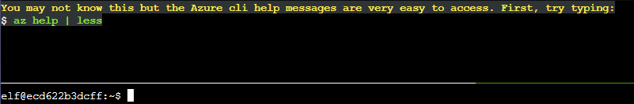
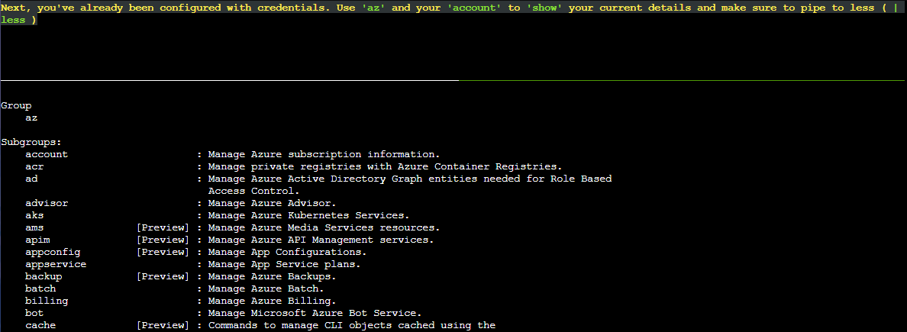
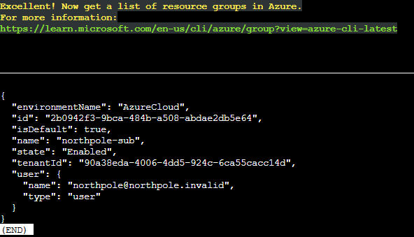
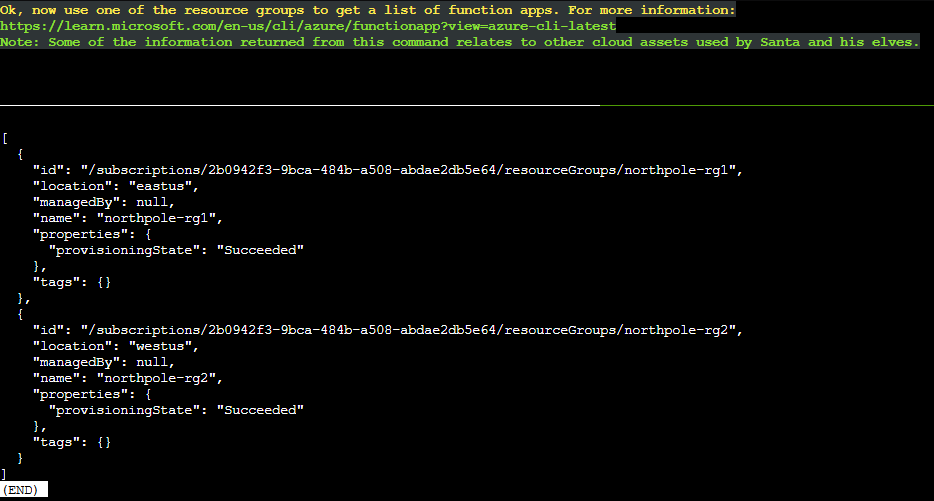
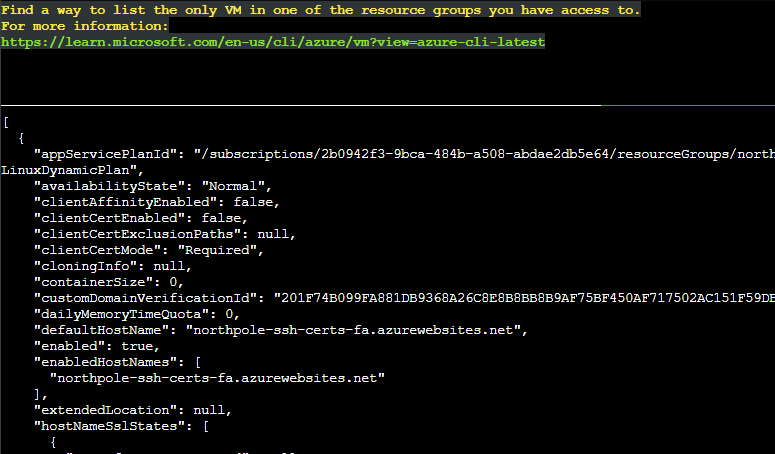
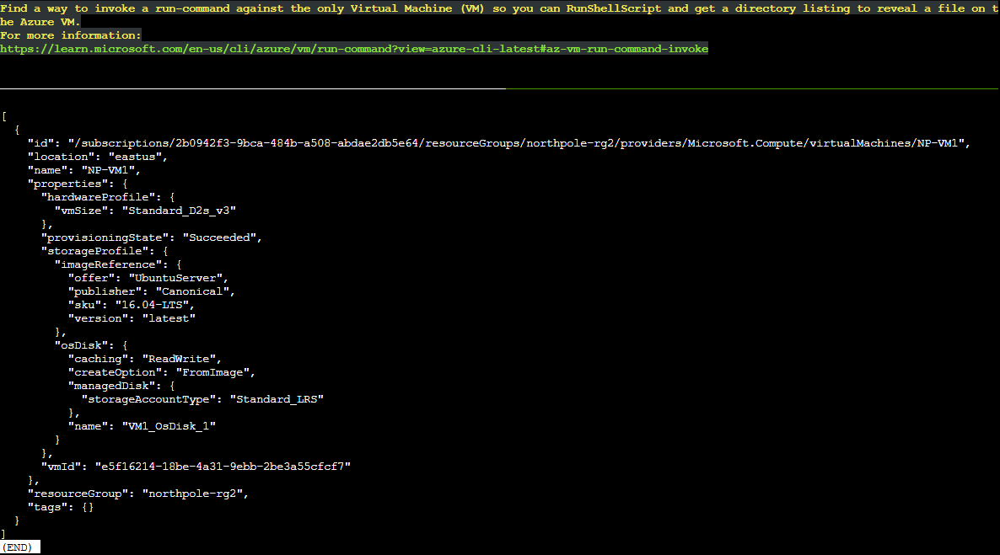
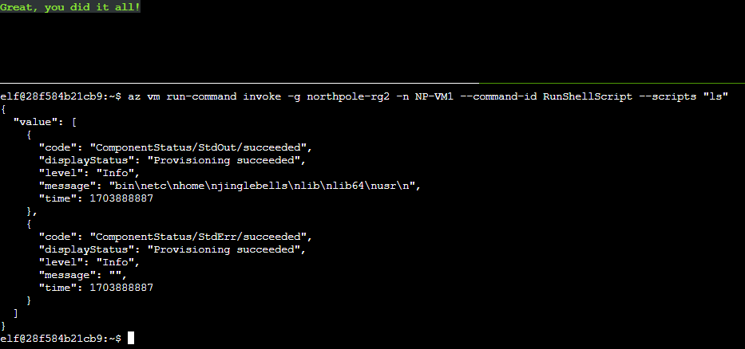

# Azure 101

**Difficulty**: :fontawesome-solid-star::fontawesome-solid-star::fontawesome-regular-star::fontawesome-regular-star::fontawesome-regular-star:<br/>
**Direct link**: [Azure 101 Terminal](https://hhc23-wetty.holidayhackchallenge.com/?&challenge=azure101&id=201f17f4-655f-477e-809c-21df925b7175)

## Objective

!!! question "Request"
    Help Sparkle Redberry with some Azure command line skills. Find the elf and the terminal on Christmas Island.

??? quote "Sparkle Redberry"
    Hey, Sparkle Redberry here! So, I've been trying to learn about Azure and the Azure CLI and it's driving me nuts.<br>
    Alabaster Snowball decided to use Azure to host some of his fancy new IT stuff on Geese Islands, and now us elves have to learn it too.<br>
    Anyway, I know it's important and everyone says it's not as difficult as it seems, but honestly it still feels like quite a challenge for me.<br>
    Alabaster sent us this [Azure CLI reference](https://learn.microsoft.com/en-us/cli/azure/reference-index?view=azure-cli-latest) as well. It's super handy, he said. Honestly, it just confuses me even more.<br>
    If you can spare a moment, would you mind giving me a hand with this terminal? I'd be really grateful! Pretty please, with holly leaves on top!

## Hints

??? tip "Azure CLI Reference"
    The Azure CLI tools come with a builtin help system, but Microsoft also provides this [handy cheatsheet](https://learn.microsoft.com/en-us/cli/azure/reference-index?view=azure-cli-latest).

## Solution

Open the terminal and follow the instructions.



### Part 1

Use the Azure command ```az help | less``` to get a list of commands.



### Part 2

Use the Azure command ```az account show | less``` to get information on the account.



### Part 3

Use the Azure command ```az group list | less``` to list the Azure groups.



### Part 4

Use the Azure command ```az functionapp list -g northpole-rg1 | less``` to list the function apps.



### Part 5

Use the Azure command ```az vm list -g northpole-rg2 | less``` to list the Azure Virtual Machines.



### Part 6

Use the Azure command ```az vm run-command invoke -g northpole-rg2 -n NP-VM1 --command-id RunShellScript --scripts "ls"``` to list the files on the Azure VM.



!!! success "Answer"
    Follow the instructions in the terminal.

## Response

!!! quote "Sparkle Redberry"
    Wow, you did it!
    It makes quite a bit more sense to me now. Thank you so much!
    That Azure Function App [URL](https://northpole-ssh-certs-fa.azurewebsites.net/api/create-cert?code=candy-cane-twirl) you came across in the terminal looked interesting.
    It might be part of that new project Alabaster has been working on with the help of ChatNPT.
    Let me tell you, since he started using ChatNPT he's been introducing a lot of amazing innovation across the islands.
    Knowing Alabaster, he'll be delighted to tell you all about it! I think I last saw him on Pixel island.
    By the way, as part of the Azure documentation he sent the elves, Alabaster also noted that if Azure CLI tools aren't available in an Azure VM we should use the [Azure REST API](https://learn.microsoft.com/en-us/entra/identity/managed-identities-azure-resources/how-to-use-vm-token) instead.
    I'm not really sure what that means, but I guess I know what I'll be studying up on next.
