# Camera Access

**Difficulty**: :fontawesome-solid-star::fontawesome-solid-star::fontawesome-solid-star::fontawesome-regular-star::fontawesome-regular-star:<br/>

## Objective

!!! question "Request"
    Gain access to Jack's camera. What's the third item on Jack's TODO list?

??? quote "Wombley Cube"
    This is Ground Control, do you read me...? Ground Control to --<br>
    Hey! How'd you get in here? That tram is the only accessible point of<br>
    entry and I secured it with MFA!<br>
    No matter, you may have had the skills to find and infiltrate the<br>
    satellite ground station, but there's no chance you can hack your way<br>
    into the satellite itself!<br>
    The nanosat's Supervisor Directory will remain hidden, and you'll never<br>
    discover the mastermind behind all this.<br>
    So don't even waste your time trying.

## Hints

??? tip "Hubris is a Virtue"
    In his hubris, Wombley revealed that he thinks you won't be able to access the satellite's "Supervisor Directory". There must be a good reason he mentioned that specifically, and a way to access it. He also said there's someone else masterminding the whole plot. There must be a way to discover who that is using the nanosat.

## Solution

Before completing this challenge, you must first complete [Space Island Door Access Speaker](./door_access_speaker.md).

First talk to the ```NanoSat-O-Matic``` in the Zenith SGS room.

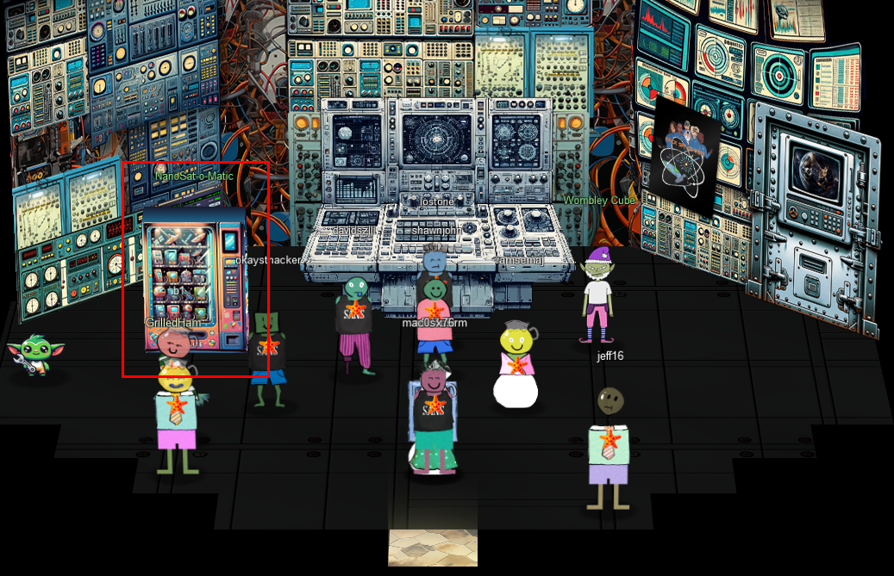

It should give you a link to download the [client_container](https://www.holidayhackchallenge.com/2023/client_container.zip). After downloading it, follow the instructions in ```README.md```.

??? quote "NanoSat-O-Matic"
    Hi there! I am a Ground station client vending machine. Apparently there is a huge need for NanoSat frameworks here, so they have put me in this room. Here, have a [free sample](https://www.holidayhackchallenge.com/2023/client_container.zip)!

First, install [Docker](https://www.docker.com/products/docker-desktop/) if you haven't already. Set up an account and run the first command in ```README.md```.

```
docker build -t nmf_client .
```

After this command finishes, run the next command.

```
docker run -it --cap-add=NET_ADMIN -p 5900:5900 -p 6901:6901 --rm nmf_client
```

Now connect to it with a [VNC client](https://www.realvnc.com/).

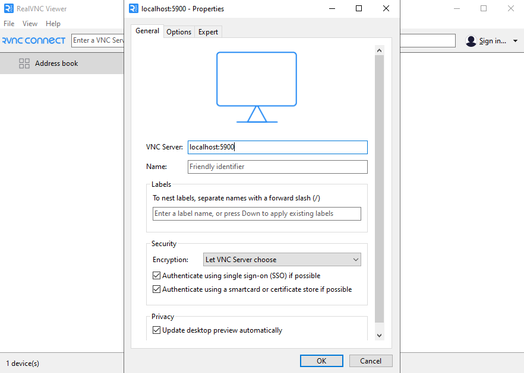

If the screen is black, restart the Docker container and try again.<br>
Once you are connected, click on the center computer back on the HHC website. Then click on the gator in the bottom right.

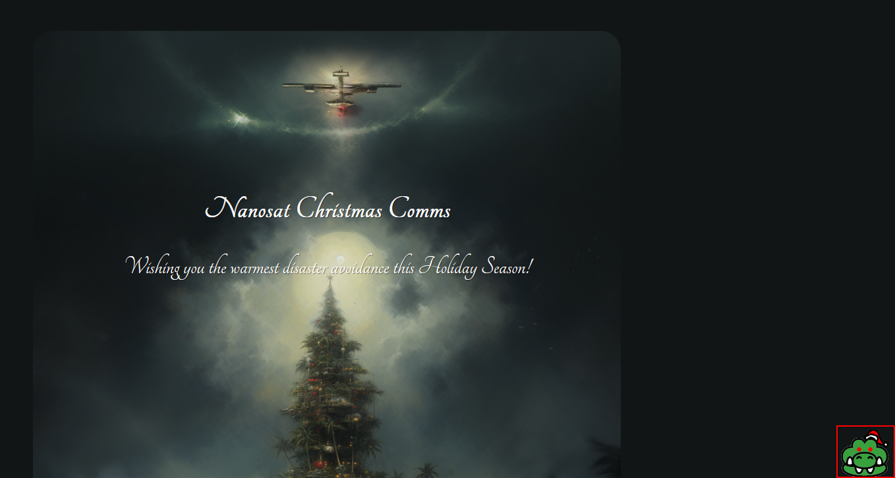

Click the "Time Travel" button and wait for it to give you a wireguard configuration.

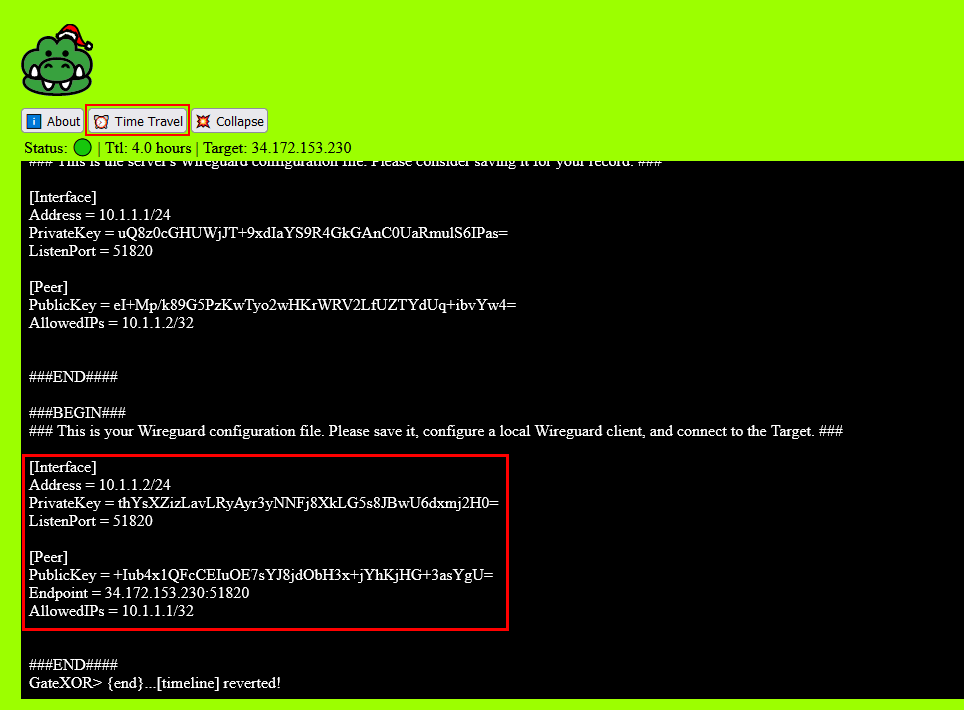

Next, on the VNC viewer, open a terminal and create a wireguard configuration file.

```
gedit /etc/wireguard/wg0.conf
```

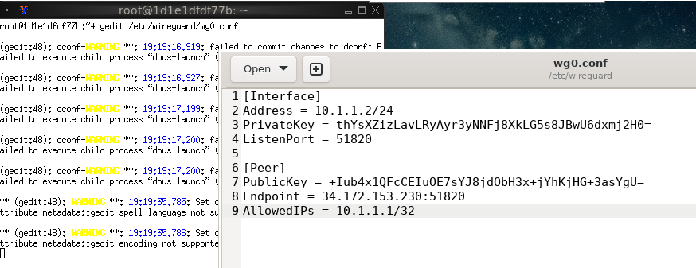

Now start the wireguard interface.

```
wg-quick up wg0
```

Now you can open the satellite tool and fetch the directory in ```README.md```.

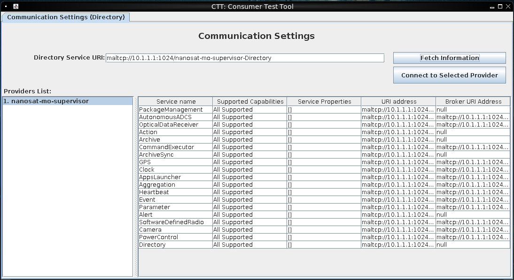

Click the connect button and you will see a camera app in the ```Apps Launcher service``` tab.

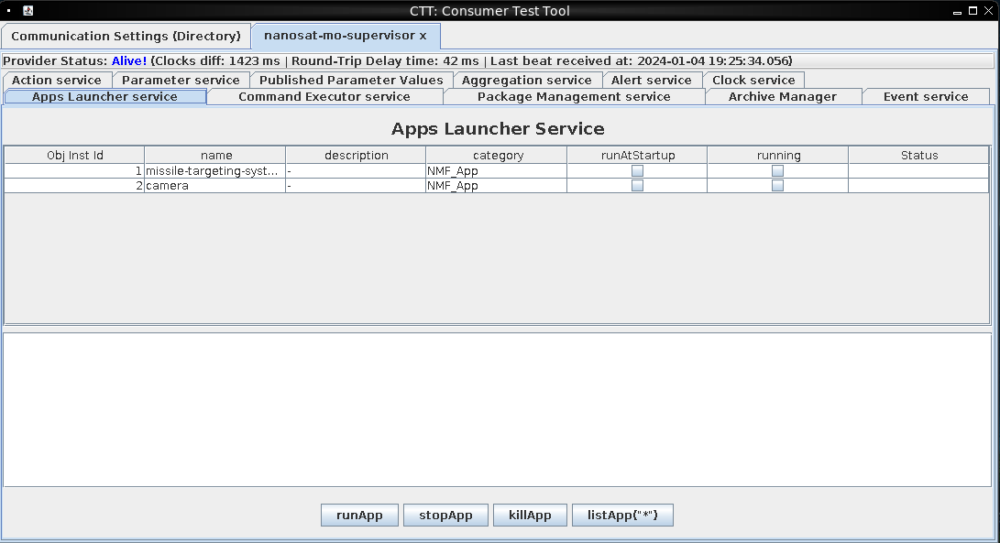

Click on the app and click ```runApp``` to run it.

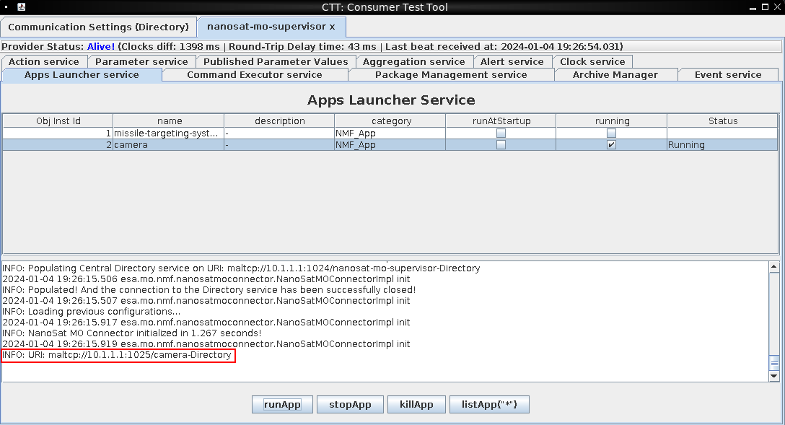

There is a URI that can be used to connect to the camera. Fetch it and connect the same way as you did for the original URI.<br>
Go to the ```Action service``` tab. There is a Base64SnapImage action that can be used to take a picture. To extract the image, you must open wireshark and intercept the TCP stream.<br>
Click on the action, then click ```submitAction```, then ```Submit```.

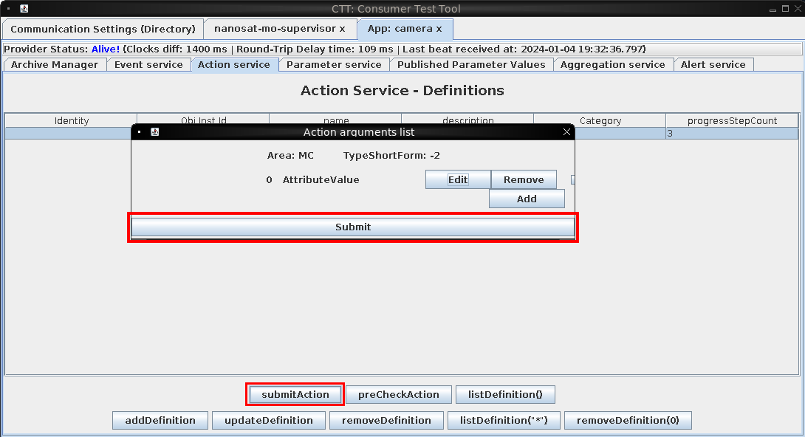

Now go to the ```Parameter service``` tab. Start capturing with wireshark and click the ```Base64SnapImage``` parameter and click ```getValue```.

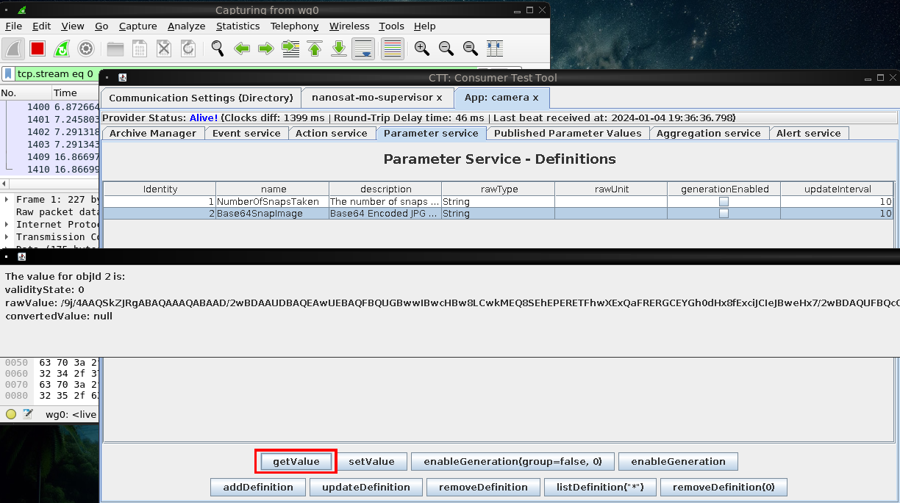

Next, go to wireshark and open the "TCP Stream" window.

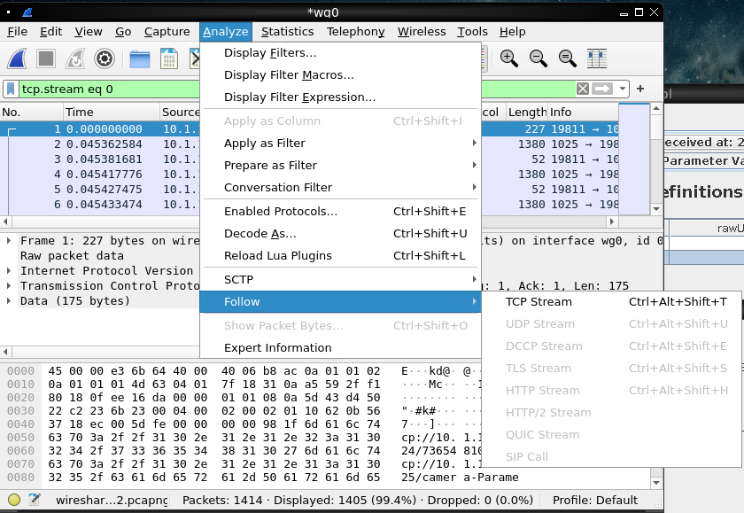

When this window finishes opening, save the TCP stream to a file.

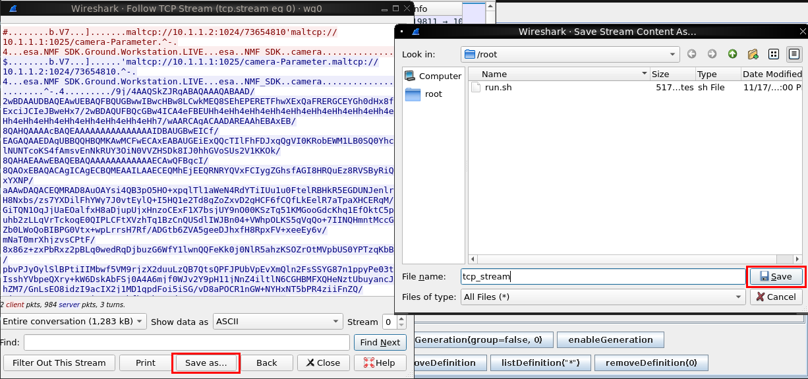

Next, open the docker desktop app and open the container's files. Find the file that you saved and download it.

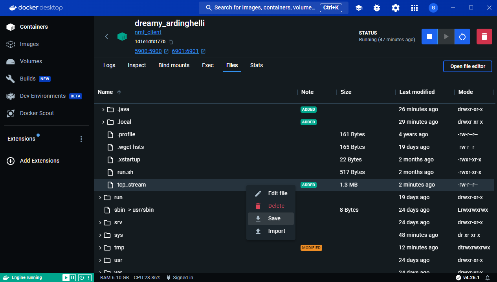

Open the file with a text editor and find the start of the base64 encoded image.

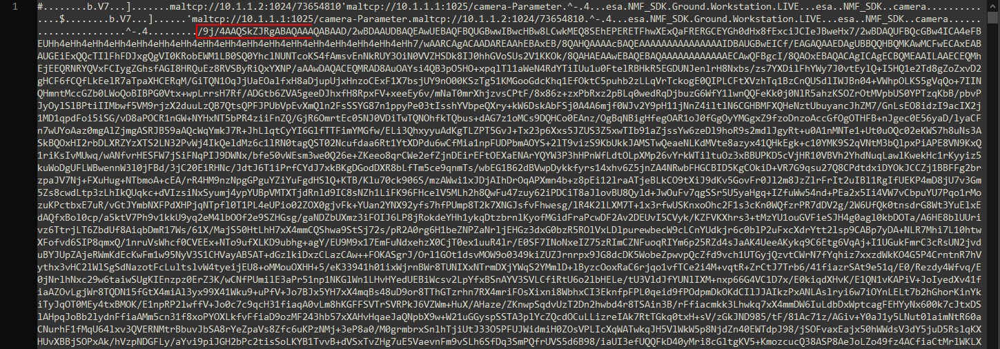

Delete everything before this, then do the same for the end of the image.<br>
Next, base64 decode the file. Using Notepad++, you can use the MIME Tools plugin directly in the editor.

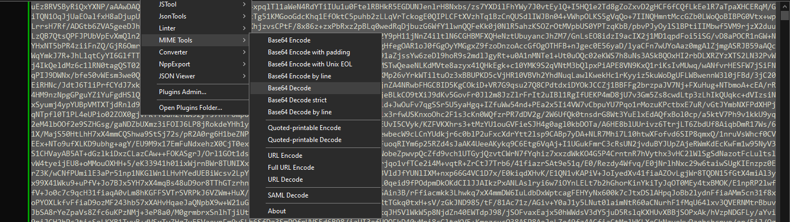

Now you can view the image and zoom in to read Jack's to-do list.

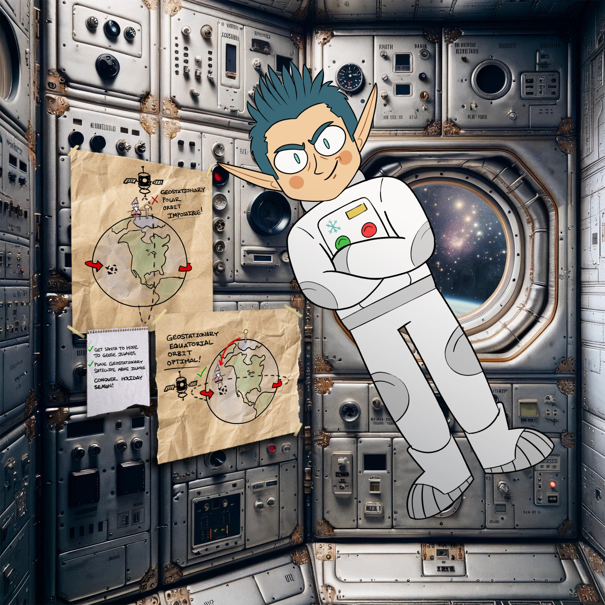

!!! success "Answer"
    CONQUER HOLIDAY SEASON!

## Response

[Missile Diversion](./missile_diversion.md)
