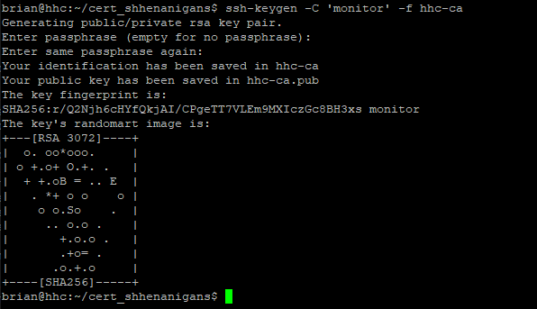
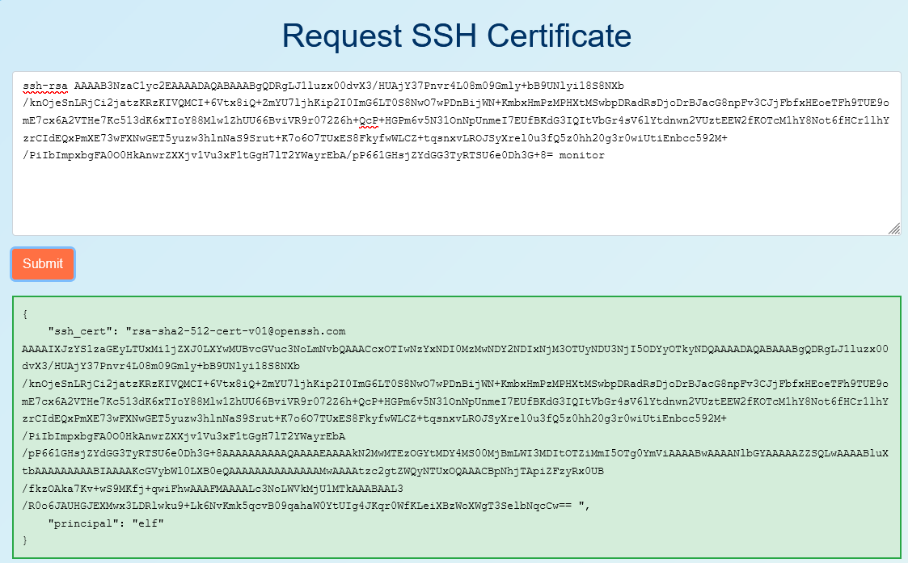
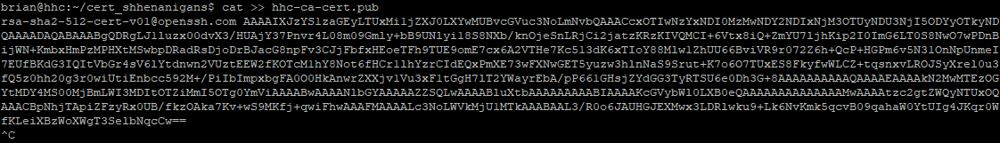
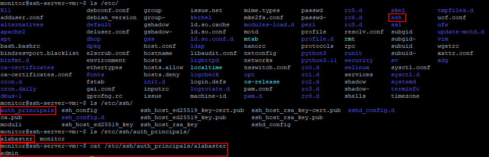
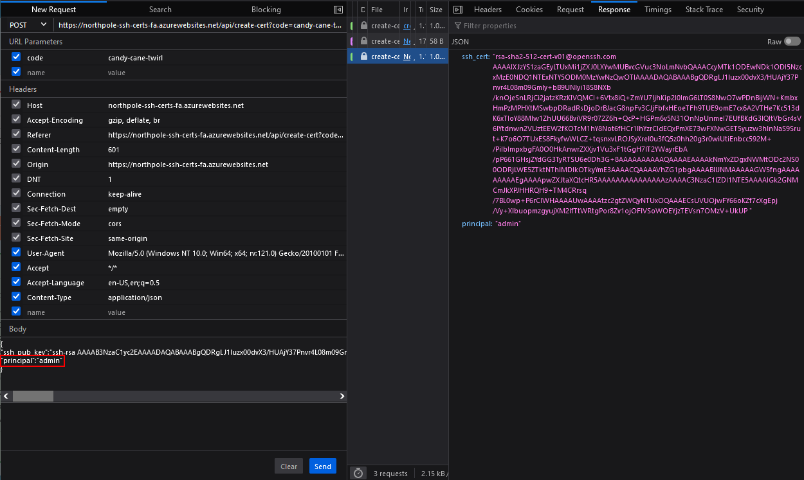
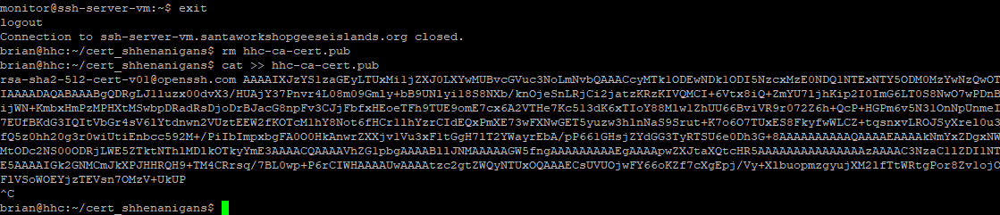
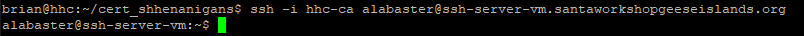
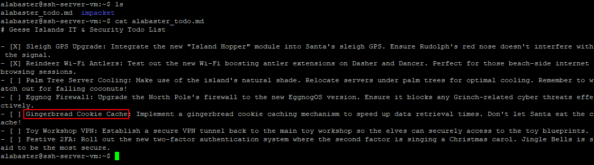

# Certificate SSHenanigans

**Difficulty**: :fontawesome-solid-star::fontawesome-solid-star::fontawesome-solid-star::fontawesome-solid-star::fontawesome-solid-star:<br/>
**Direct link**: [SSH Certificate Website](https://northpole-ssh-certs-fa.azurewebsites.net/api/create-cert?code=candy-cane-twirl)

## Objective

!!! question "Request"
    Go to Pixel Island and review Alabaster Snowball's new SSH certificate configuration and Azure [Function App](https://northpole-ssh-certs-fa.azurewebsites.net/api/create-cert?code=candy-cane-twirl). What type of cookie cache is Alabaster planning to implement?

??? quote "Alabaster Snowball"
    Hello there! Alabaster Snowball at your service.<br>
    I could use your help with my fancy new Azure server at **ssh-server-vm.santaworkshopgeeseislands.org**.<br>
    ChatNPT suggested I upgrade the host to use SSH certificates, such a great idea!<br>
    It even generated ready-to-deploy code for an [Azure Function App](https://northpole-ssh-certs-fa.azurewebsites.net/api/create-cert?code=candy-cane-twirl) so elves can request their own certificates. What a timesaver!<br>
    I'm a little wary though. I'd appreciate it if you could take a peek and confirm everything's secure before I deploy this configuration to all the Geese Islands servers.<br>
    Generate yourself a certificate and use the _monitor_ account to access the host. See if you can grab my TODO list.<br>
    If you haven't heard of SSH certificates, Thomas Bouve gave an introductory talk and demo on that topic recently.<br>
    Oh, and if you need to peek at the Function App code, there's a handy [Azure REST API endpoint](https://learn.microsoft.com/en-us/rest/api/appservice/web-apps/get-source-control) which will give you details about how the Function App is deployed.

## Hints

??? tip "Azure Function App Source Code"
    The [get-source-control](https://learn.microsoft.com/en-us/rest/api/appservice/web-apps/get-source-control) Azure REST API endpoint provides details about where an Azure Web App or Function App is deployed from.

??? tip "Azure VM Access Token"
    Azure CLI tools aren't always available, but if you're on an Azure VM you can always use the [Azure REST API](https://learn.microsoft.com/en-us/entra/identity/managed-identities-azure-resources/how-to-use-vm-token) instead.

??? tip "SSH Certificates Talk"
    Check out Thomas Bouve's [talk and demo](https://youtu.be/4S0Rniyidt4) to learn all about how you can upgrade your SSH server configuration to leverage SSH certificates.

## Solution

To access the ssh server, create a new ssh key.

```ssh-keygen -C 'monitor' -f <key-file-name>```



Next, copy your new public key and submit it to the [certificate request website](https://northpole-ssh-certs-fa.azurewebsites.net/api/create-cert?code=candy-cane-twirl).



Now copy the certificate into a file called ```<key-file-name>-cert.pub```.



You should now be able to connect to the ssh server with ```ssh -i hhc-ca monitor@ssh-server-vm.santaworkshopgeeseislands.org```.

Once on the ssh server, a program is already open. This can be closed with ```Ctrl+C```.<br>
Now we can look around in the server for something that can help us.<br>
The auth principals are visible in ```/etc/ssh/auth_principals/```.



Now that we know the principal needed to log in as Alabaster, we can try to get a new certificate with that principal.<br>
Simply resending the request to the website with ```"principal":"admin"``` added to the JSON request body will accomplish this.



Next, close the connection to the ssh server and replace the old certificate with the new admin one.



You should now be able to log in as Alabaster with ```ssh -i hhc-ca alabaster@ssh-server-vm.santaworkshopgeeseislands.org```.



Now check the TODO list in his home directory and submit the type of cookie cache he is planning on implementing.



!!! success "Answer"
    Gingerbread

## Response

!!! quote "Alabaster Snowball"
    Oh my! I was so focused on the SSH configuration I completely missed the vulnerability in the Azure Function App.<br>
    Why would ChatNPT generate code with such a glaring vulnerability? It's almost like it wanted my system to be unsafe. Could ChatNPT be evil?<br>
    Thanks for the help, I'll go and update the application code immediately!<br>
    While we're on the topic of certificates, did you know Active Directory (AD) uses them as well? Apparently the service used to manage them can have misconfigurations too.<br>
    You might be wondering about that SatTrackr tool I've installed on the monitor account?<br>
    Here's the thing, on my nightly stargazing adventures I started noticing the same satellite above Geese Islands.<br>
    I wrote that satellite tracker tool to collect some additional data and sure enough, it's in a geostationary orbit above us.<br>
    No idea what that means yet, but I'm keeping a close eye on that thing!
