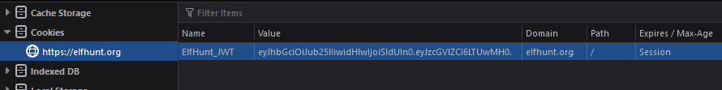
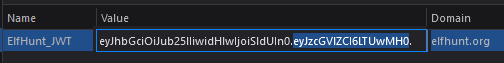
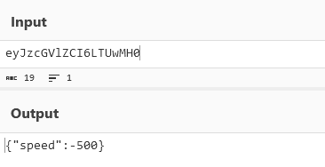
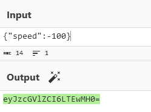
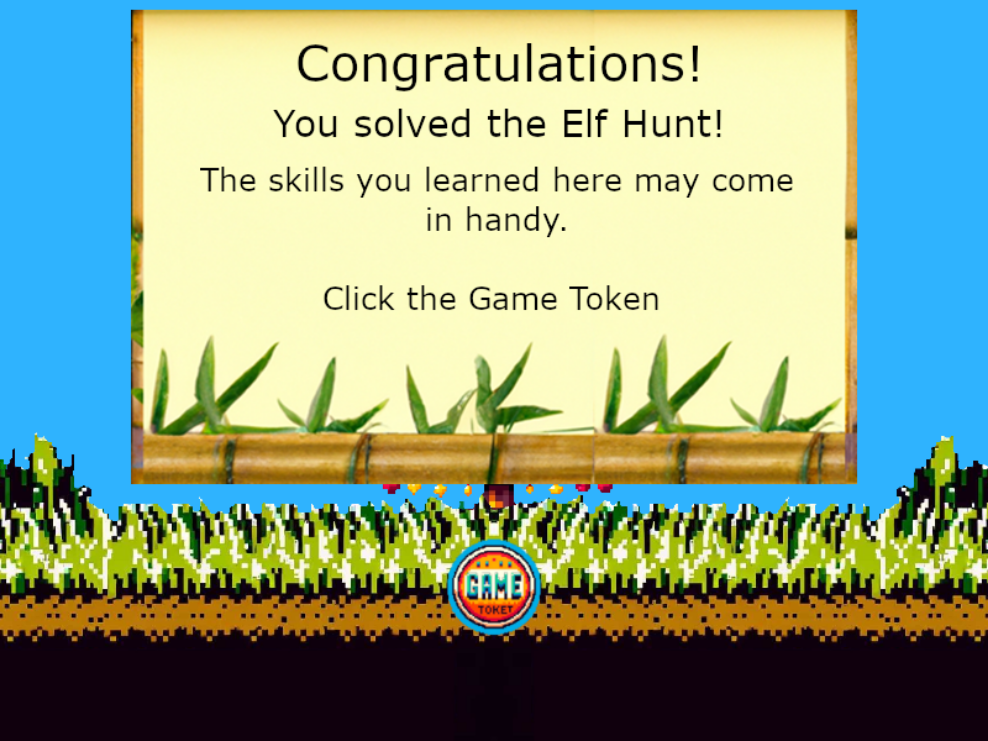

# Elf Hunt

**Difficulty**: :fontawesome-solid-star::fontawesome-solid-star::fontawesome-solid-star::fontawesome-regular-star::fontawesome-regular-star: 
**Direct link**: [Elf Hunt Terminal](https://elfhunt.org/?&challenge=elfhunt&id=494a7135-624b-4ee1-823a-b523edb9e92e)

## Objective

!!! question "Request"
    Piney Sappington needs a lesson in JSON web tokens. Hack Elf Hunt and score 75 points.

??? quote "Piney Sappington"
    Hey there, friend! Piney Sappington here. 
    You look like someone who's good with puzzles and games. 
    I could really use your help with this Elf Hunt game I'm stuck on. 
    I think it has something to do with manipulating JWTs, but I'm a bit lost. 
    If you help me out, I might share some juicy secrets I've discovered. 
    Let's just say things around here haven't been exactly... normal. 
    So, what do ya say? Are you in? 
    Oh, brilliant! I just know we'll crack this game together. 
    I can't wait to see what we uncover, and remember, mum's the word! 
    Thanks a bunch! Keep your eyes open and your ears to the ground.

## Hints

??? tip "JWT Sectrets Revealed"
    Unlock the mysteries of JWTs with insights from [PortSwigger's JWT Guide](https://portswigger.net/web-security/jwt).

## Solution

To complete the challenge, click the elves before they go offscreen. You need to click 75 elves to win. If the elves are moving too fast and you can't click them, you can slow them down by changing the cookie.

To do this, copy the part of the cookie between the two periods.

Then decode it as base64.

Next, change the value of speed and re-encode it.

Finally, paste the new value back into the cookie and reload the page. 
After reloading, you should have an easier time clicking the elves.

!!! success "Answer"
    Click the elves to win the game.

## Response

!!! quote "Piney Sappington"
    Well done! You've brilliantly won Elf Hunt! I couldn't be more thrilled. Keep up the fine work, my friend! 
    What have you found there? The Captain's Journal? Yeah, he comes around a lot. You can find his comms office over at Brass Buoy Port on Steampunk Island.
