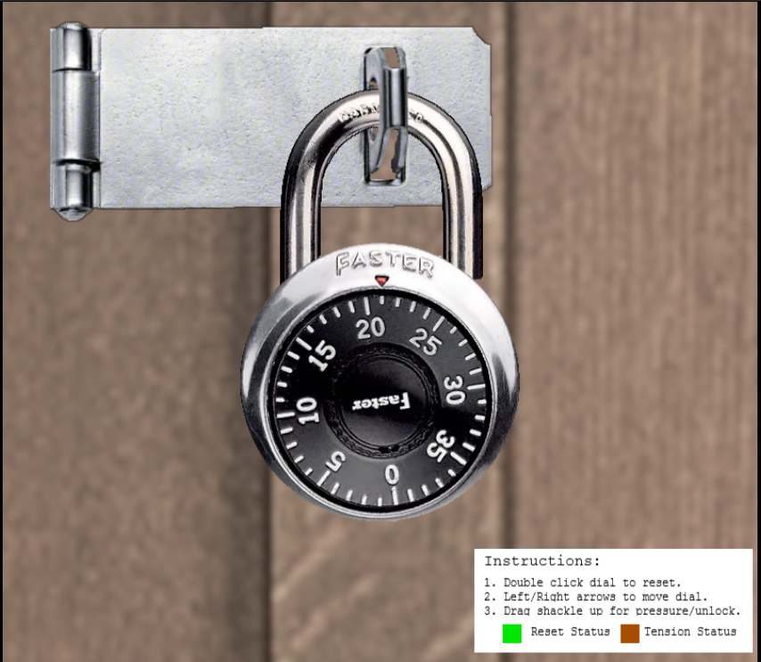
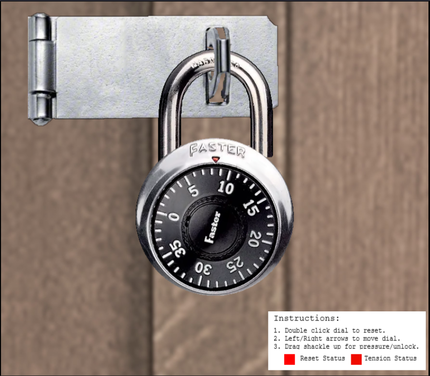
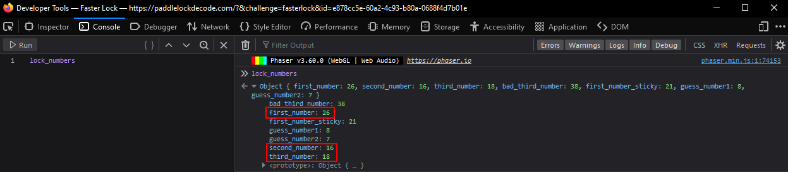

# Faster Lock Combinnation

**Difficulty**: :fontawesome-solid-star::fontawesome-solid-star::fontawesome-regular-star::fontawesome-regular-star::fontawesome-regular-star:<br/>
**Direct link**: [Faster Lock Terminal](https://paddlelockdecode.com/?&challenge=fasterlock&id=e878cc5e-60a2-4c93-b80a-0688f4d7b01e)

## Objective

!!! question "Request"
    Over on Steampunk Island, Bow Ninecandle is having trouble opening a padlock. Do some research and see if you can help open it!

??? quote "Bow Ninecandle"
    Hey there! I'm Bow Ninecandle, and I've got a bit of a... 'pressing' situation.<br>
    You see, I need to get into the lavatory, but here's the twist: it's secured with a combination padlock.<br>
    Talk about bad timing, right? I could really use your help to figure this out before things get... well, urgent.<br>
    I'm sure there are some clever tricks and tips floating around [the web](https://www.youtube.com/watch?v=27rE5ZvWLU0) that can help us crack this code without too much of a flush... I mean fuss.<br>
    Remember, we're aiming for quick and easy solutions here - nothing too complex.<br>
    Once we've gathered a few possible combinations, let's team up and try them out.<br>
    I'm crossing my legs - I mean fingers - hoping we can unlock this door soon.<br>
    After all, everyone knows that the key to holiday happiness is an accessible lavatory!<br>
    Let's dive into this challenge and hopefully, we won't have to 'hold it' for too long! Ready to help me out?

## Solution

Follow the steps in the [video](https://www.youtube.com/watch?v=27rE5ZvWLU0) provided by Bow Ninecandle.<br>
First, use the mouse to pull the shackle up a bit and rotate the lock clockwise with the right arrow key until it slows down.



Write this number down.<br>
Next, reset the lock by double clicking it. The next two numbers you need can be found by pulling the shackle all the way and turning the lock back and forth. Start at 0 and work your way up to 10. If the lock stops in between two numbers, write that number down.



Now that you have all the numbers, you can start figuring out the combination.<br>
Start by adding 5 to the first number.
```
21 + 5 = 26
```
This is the first number of the combination.<br>
Next, create a table using the other two numbers by adding 10 until they reach 30.<br>
```
7 17 27 37
8 18 28 38
```
Next, find the remainder of the first number when divided by 4.
```
26 % 4 = 2
```
Now filter the table by checking each remainder against the remainder of the first number.
```
18 % 4 = 2
38 % 4 = 2
```
Reset the lock and check both of these numbers to see which one feels looser when the shackle is fully pulled out. In this case it seems to be 18. This is probably the last number in the combination.<br>
Now add 2 to the remainder and create a list of numbers by adding 4 each time.
```
4 8 12 16 20 24 28 32 36 40
```
Since there is no 40 on the lock, subtract 40 from it to get 0.<br>
Now check every combination of numbers.
```
26 (4 8 12 16 20 24 28 32 36 40) 18
```
The combination for this lock is ```26 16 18```.<br>

!!! note "Using the console to find the combination<span id="cheating"></span>"
    You can also use the console to find the combination by printing the ```lock_numbers``` variable.
    

!!! success "Answer"
    Pick the lock.

## Response

!!! quote "Bow Ninecandle"
    Oh, thank heavens! You're a lifesaver! With your knack for cracking codes, we've just turned a potential 'loo catastrophe' into a holiday triumph!
