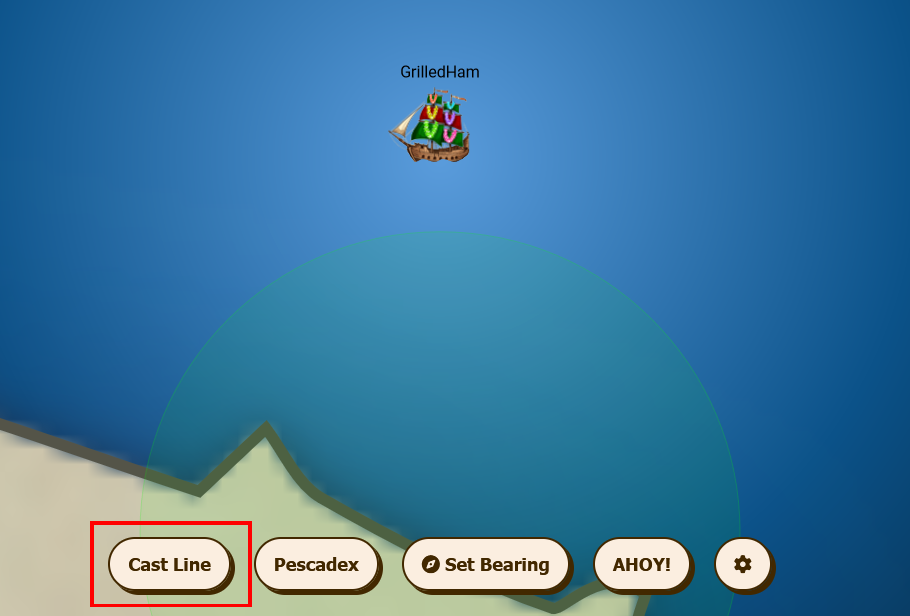
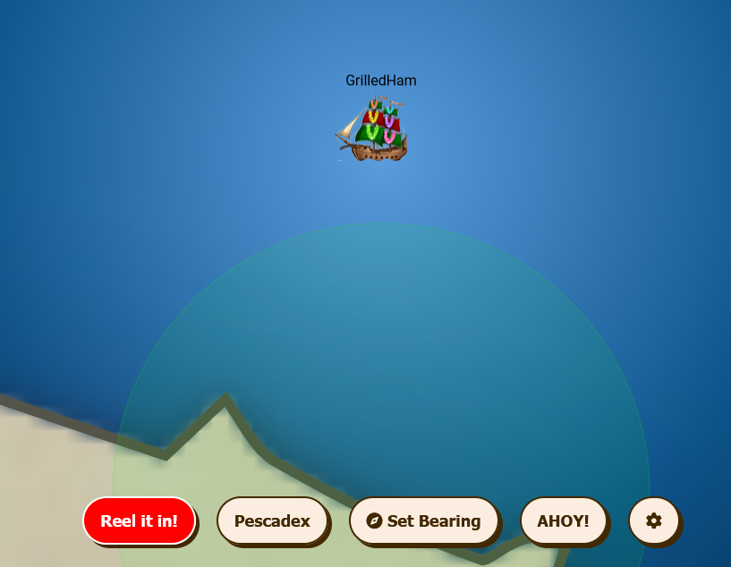

# BONUS! Fishing Guide

**Difficulty**: :fontawesome-solid-star::fontawesome-regular-star::fontawesome-regular-star::fontawesome-regular-star::fontawesome-regular-star: 

## Objective

!!! question "Request"
    Catch twenty different species of fish that live around Geese Islands. When you're done, report your findings to Poinsettia McMittens on the Island of Misfit Toys.

??? quote "Poinsettia McMittens"
    Excuse me, but you're interrupting my fishing serenity. Oh, you'd like to know how to become as good at fishing as I am? 
    Well, first of all, thank you for noticing my flair for fishing. It's not just about looking good beside the lake, you know. 
    The key is in the details, much like crafting the perfect toy. Observe the water, the weather, and the fish’s habits - it's a science and an art. 
    Of course, it helps to have a natural charm. Fish seem to find me irresistible. Must be my sparkling personality... or maybe it's just the glitter of my allure. 
    Oh, the mysteries of the aquatic life around these islands are as elusive as, well, a clever compliment. But you'll get one if you probe enough. 
    Remember, patience is more than a virtue in fishing; it’s a strategy. Like waiting for the right time to use flattery, you wait for the right moment to strike. 
    Go see if you can catch, say, 20 different types of fish!

## Solution

Talk to Poinsettia McMittens to get the fishing rod item. Then go to sea and cast the line.

Reel in the line when the "Reel it in" button turns red.

Repeat this until you have caught 20 different types of fish.

!!! success "Answer"
    Catch 20 different fish.

## Response

[BONUS! Fishing Mastery](./fishing_mastery.md)
