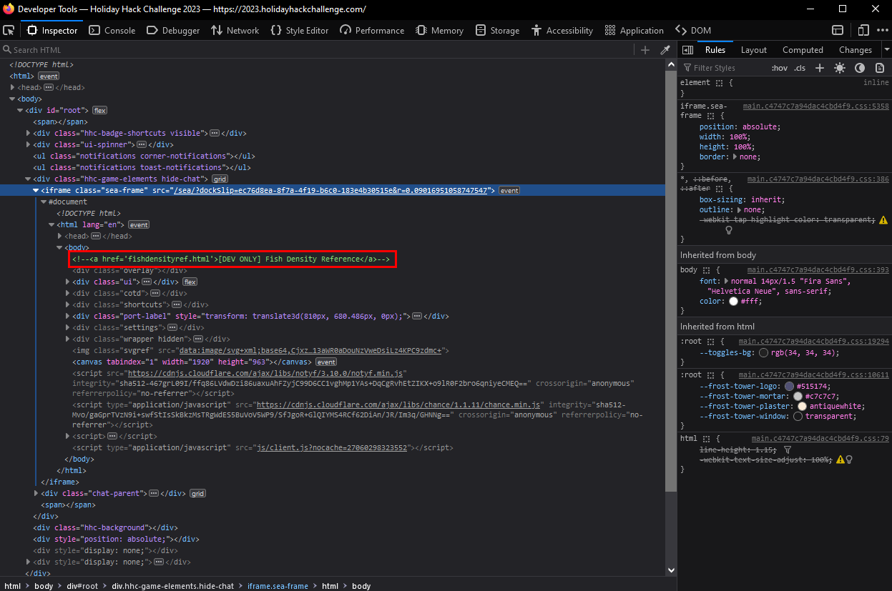
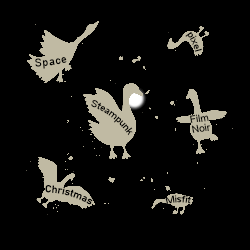
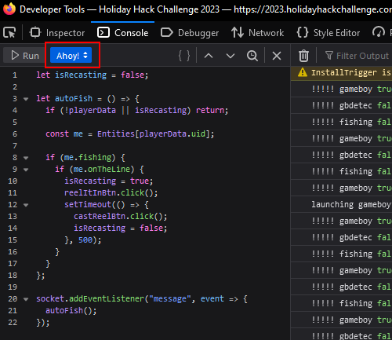

# BONUS! Fishing Mastery

**Difficulty**: :fontawesome-solid-star::fontawesome-solid-star::fontawesome-solid-star::fontawesome-solid-star::fontawesome-regular-star:<br/>

## Objective

!!! question "Request"
    Catch at least one of each species of fish that live around Geese islands. When you're done, report your findings to Poinsettia McMittens.

??? quote "Poinsettia McMittens"
    Hoy small fry, nice work!<br>
    Now, just imagine if we had an automatic fish catcher? It would be as ingenious as me on a good day!<br>
    I came across [this fascinating article](https://www.redhat.com/sysadmin/getting-started-socat) about such a device in a magazine during one of my more glamorous fishing sessions.<br>
    If only I could get my hands on it, I'd be the undisputed queen of catching them all!

## Hints

??? tip "Fishing Machine"
    There are a variety of strategies for automating repetative website tasks. Tools such as [AutoKey](https://github.com/autokey/autokey) and [AutoIt](https://www.autoitscript.com/site/) allow you to programmatically examine elements on the screen and emulate user inputs.

??? tip "I Am Become Data"
    One approach to automating web tasks entails the browser's developer console. Browsers' console allow us to manipulate objects, inspect code, and even interact with [websockets](https://javascript.info/websocket).

??? tip "Become the Fish"
    Perhaps there are some clues about the local aquatic life located in the HTML source code.

## Solution

To find where all the fish are located at, open the developer tools and check through the HTML.



There is a comment with a fish density reference. Going to the [reference](https://2023.holidayhackchallenge.com/sea/fishdensityref.html) will reveal the places where certain fish can be caught. Since the "Piscis Cyberneticus Skodo" has the least area, that should be where you start.<br>
You can find where this is on the map by downloading it and overlaying it on top of the density reference.



Now that you know how to find all the fish, you can automate the fishing process. To do this, simply open the developer console and paste the following into the console.

```javascript
let isRecasting = false;

let autoFish = () => {
  if (!playerData || isRecasting) return;
  
  const me = Entities[playerData.uid];

  if (me.fishing) {
    if (me.onTheLine) {
      isRecasting = true;
      reelItInBtn.click();
      setTimeout(() => {
        castReelBtn.click();
        isRecasting = false;
      }, 500);
    }
  }
};

socket.addEventListener("message", event => {
  autoFish();
});
```

Make sure to set the context to "Ahoy!" before running it.



To start fishing, simply click the "Cast Line" button. To stop, click "Reel it in" when it's not red.

!!! success "Answer"
    Catch all the fish.

## Response

!!! quote "Poinsettia McMittens"
    You managed to catch every fish? You're like the fishing version of a Christmas miracle!<br>
    Now, if only you could teach me your ways... but then again, I'm already pretty fabulous at everything I do.
