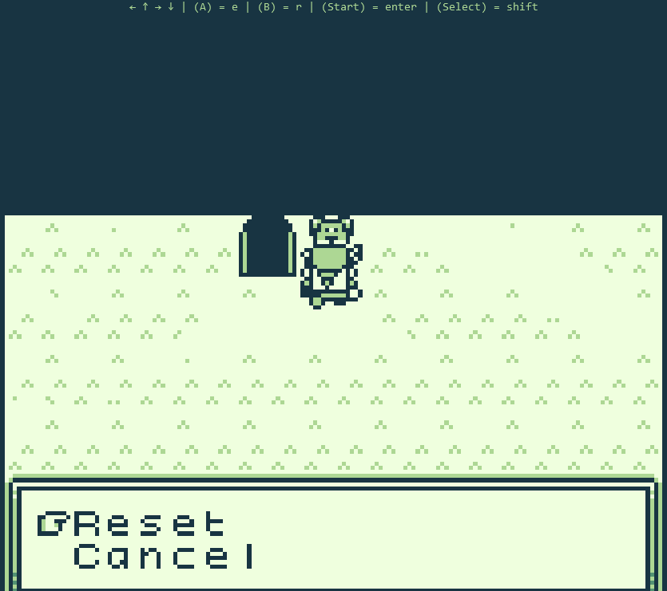
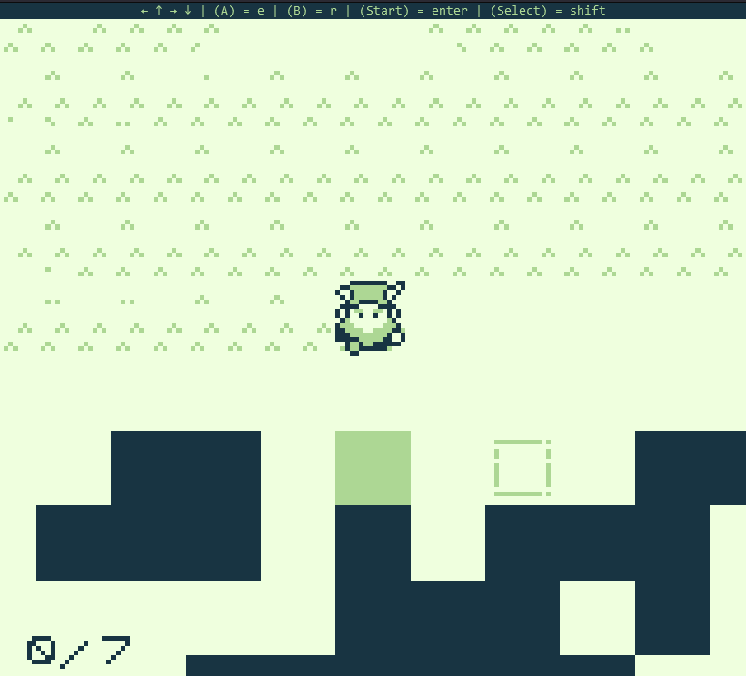
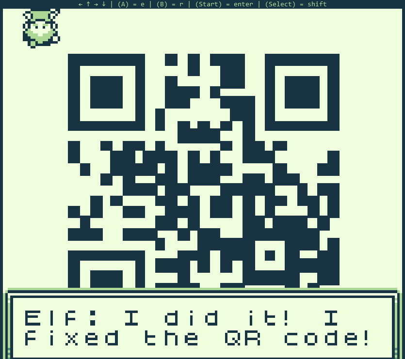

# Game Cartridges: Vol 1

**Difficulty**: :fontawesome-solid-star::fontawesome-regular-star::fontawesome-regular-star::fontawesome-regular-star::fontawesome-regular-star:<br/>
**Direct link**: [Game Cartridge 1](https://gamegosling.com/vol1-uWn1t6xv4VKPZ6FN/index.html?&challenge=gameboy1&id=e17e854e-433d-46cf-b4ab-1d9e12a91ff0)

## Objective

!!! question "Request"
    Find the first Gamegosling cartridge and beat the game

??? quote "Dusty Giftwrap"
    Arrr, matey, shiver me timbers! There be buried treasure herrrrre.<br>
    Just kidding, I'm not really a pirate, I was just hoping it would make finding the treasure easier.<br>
    I guess you heard about the fabled buried treasure, too? I didn't expect to see anyone else here. This uncharted islet was hard to find.<br>
    There are 3 buried treasures in total, each in its own uncharted area around Geese Islands.<br>
    I've been searching for hours now with no luck, and these strange toys are starting to give me the creeps.<br>
    Maybe you'll be able to find it. Here, use my Gameboy Cartridge Detector. Go into your items and test it to make sure it's still working.<br>
    When you get close to the treasure, it'll start sounding off. The closer you get, the louder the sound.<br>
    No need to activate or fiddle with it. It just works!<br>
    I bet one of these creepy toys has the treasure, and I'm sure not going anywhere near them!<br>
    If you find the treasure, come back and show me, and I'll tell you what I was able to research about it.<br>
    Good luck!

## Hints

??? tip "Approximate Proximity"
    Listen for the gameboy cartridge detector's proximity sound that activates when near buried treasure. It may be worth checking around the strange toys in the Tarnished Trove.

??? tip "Gameboy 1"
    1) Giving things a little push never hurts. 2) Out of sight but not out of ear-shot 3) You think you fixed the QR code? Did you scan it and see where it leads?

## Solution

The first Gameboy cartridge can be found in the northwest part of Tarnished Trove. Once you find the cartridge, talk to Dusty Giftwrap again for a hint.

!!! quote "Dusty Giftwrap"
    Whoa, you found it!<br>
    It's a... video game cartridge? Coooooollll... I mean, arrrrrr....<br>
    So, here's what my research uncovered. Not sure what it all means, maybe you can make sense of it.

Now you can go to your items and play the game.<br>
Progress through to the last room of the game and start fixing the QR code. If you mess up, you can reset it by talking to the dog.



To fix the QR code, press ```r``` to sing to the blocks. If one of them starts flashing, it is in the wrong place and must be pushed to the other flashing area.



After fixing the code, you can scan it and enter the flag into the objectives.



!!! success "Answer"
    santaconfusedgivingplanetsqrcode
