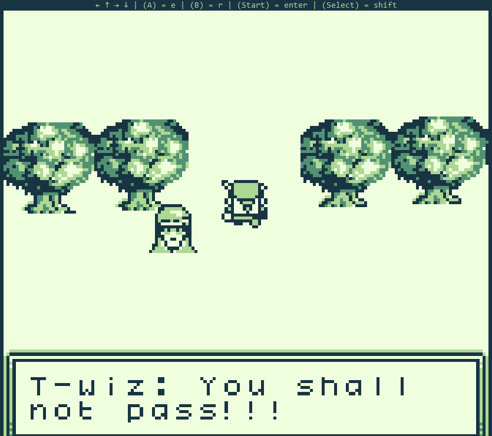
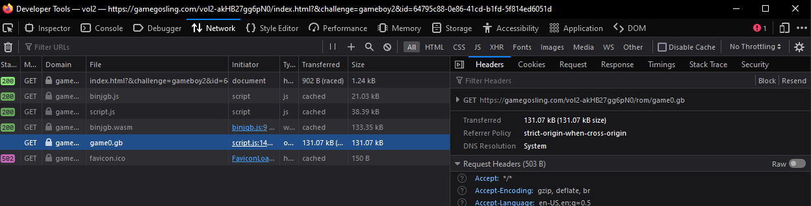
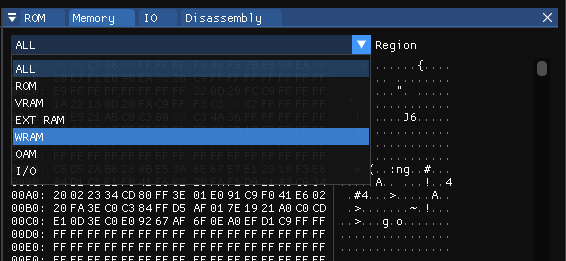
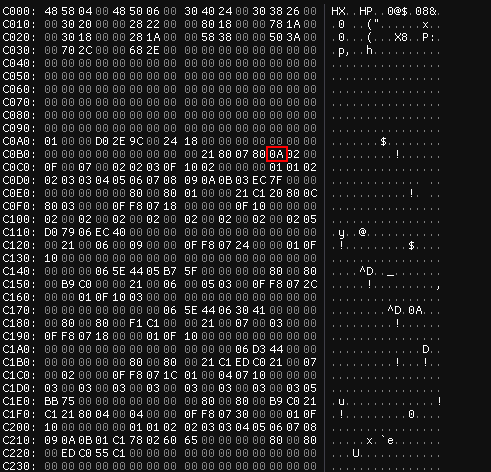
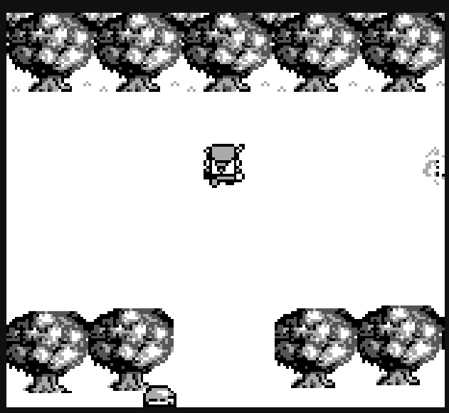
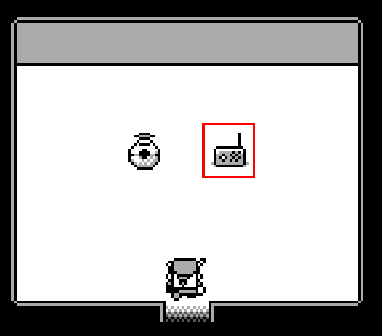

# Game Cartridges: Vol 2

**Difficulty**: :fontawesome-solid-star::fontawesome-solid-star::fontawesome-solid-star::fontawesome-regular-star::fontawesome-regular-star:<br/>
**Direct link**: [Game Cartridge 2](https://gamegosling.com/vol2-akHB27gg6pN0/index.html?&challenge=gameboy2&id=64795c88-0e86-41cd-b1fd-5f814ed6051d)

## Objective

!!! question "Request"
    Find the second Gamegosling cartridge and beat the game

??? quote "Tinsel Upatree"
    I can't believe I was actually able to find this underground cavern!<br>
    I discovered what looked liike an old pirate map in the attic of one of those huts in Rainraster Cliffs, and it actually led somewhere!<br>
    But now that I've seen where it leads, I think this might've been a bad idea. This place is scary! Maybe you want to take it from here?<br>
    I'm sure that cartridge is right nearby. Start walking around!<br>
    Once you run into it, check back with me and I'll tell you what I know about winning.<br>
    Good luck!

## Hints

??? tip "Gameboy 2"
    Try poking around Pixel Island. There really aren't many places you can go here, so try stepping everywhere and see what you get!

??? tip "Gameboy 2"
    1) This feels the same, but different! 2) If it feels like you are going crazy, you probably are! Or maybe, just maybe, you've not yet figured out where the hidden ROM is hiding. 3) I think I may need to get a DIFFerent perspective. 4) I wonder if someone can give me a few pointers to swap.

## Solution

After finding the second cartridge in Driftbit Grotto, talk to Tinsel Upatree for hints.

!!! quote "Tinsel Upatree"
    Whoa, you found it!<br>
    What version is it?<br>
    Did you know that many games had multiple versions released? Word is: volume 2 has 2 versions!

Now that you have the cartridge, you can try to play the game.



It seems that T-wiz won't let you pass. To get around this, download the game by finding the url.



Next, download [binjgb](https://github.com/binji/binjgb) and run the game using ```binjgb-debugger.exe```.

Go to the ```Memory``` tab and select the ```WRAM``` region.



Play the game again. This time, when you try walking up, look for places in memory that might correspond to your y-position.



After you find the correct byte, you can change it by clicking on it and typing. This allows you to teleport through the barrier.



Next, go to the weird fire-looking thing on the right side of the screen and press ```x```. There is a radio on the right side of this new room. Turn it on with ```x```.



The radio is looping a morse code message. Decoding it gives us ```GL0RY```.

!!! success "Answer"
    GL0RY
