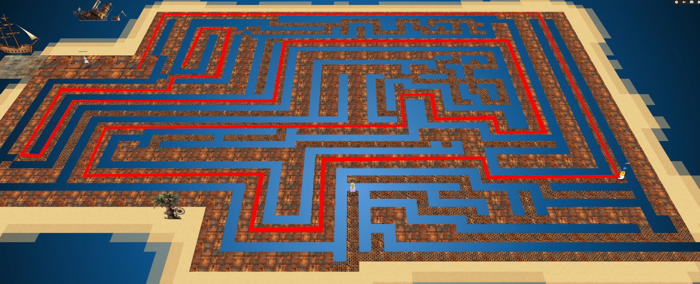
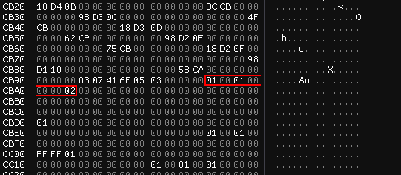
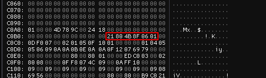
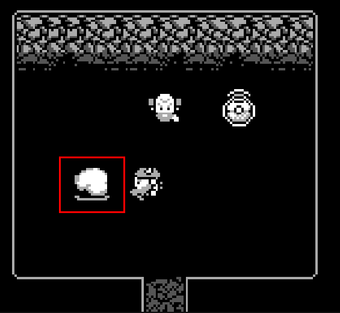

# Game Cartridges: Vol 3

**Difficulty**: :fontawesome-solid-star::fontawesome-solid-star::fontawesome-solid-star::fontawesome-regular-star::fontawesome-regular-star:<br/>
**Direct link**: [Game Cartridge 3](https://gamegosling.com/vol3-7bNwQKGBFNGQT1/index.html?&challenge=gameboy3&id=141d5ac8-0061-4b7f-89cc-54aebea9df49)

## Objective

!!! question "Request"
    Find the third Gamegosling cartridge and beat the game

??? quote "Angel Candysalt"
    The name's Angel Candysalt, the great treasure hunter!<br>
    A euphemism? No, why do people always ask me that??<br>
    Anyways, I came here to nab the treasure hidden in this ship graveyard, only to discover it's protected by this rusted maze.<br>
    That must be why all these old ships are here. Their crew came to find the treasure, only to get lost in the labrynth.<br>
    At least it's obvious where this one is. See that shiny spot over to the right? That's gotta be where it is! If only I had a bird's eye view.<br>
    But how to get there? Up? Down? Left? Right? Oh well, that's your problem now!<br>
    Come back if you can find your way to it, and I'll tell you some secrets I've heard about this one.

## Hints

??? tip "Gameboy 3"
    1) This one is a bit long, it never hurts to save your progress! 2) 8bit systems have much smaller registers than you’re used to. 3) Isn’t this great?!? The coins are OVERFLOWing in their abundance.

??? tip "Bird's Eye View"
    The location of the treasure in Rusty Quay is marked by a shiny spot on the ground. To help with navigating the maze, try zooming out and changing the camera angle.

## Solution

To find the last cartridge, go to Rusty Quay and zoom out to find the correct path.



Talk to Angel Candysalt again for hints.

!!! quote "Angel Candysalt"
    The life of a treasure hunter isn't easy, but it sure is exciting!<br>
    Oh it's a video game, I love video games! But you've claimed this treasure, nicely done.<br>
    Now, about those secrets I've been told. They're pretty cryptic, but they are. Hopefully that helps with something!

Pick up the last cartridge and download it like you did the [second one](./game_cartridges_2.md). Run the downloaded file using [binjgb](https://github.com/binji/binjgb). Open the ```Memory``` tab and select the ```WRAM``` region.<br>
Now play the game and try to get to the end. At the end, you will find that you need 999 coins to continue. To acheive this, look for where the coins are stored in memory and change their values.



You can also find where your position is stored to make getting to the end of the level easier.



At the end, go through the door and talk to the NPCs. If you have 999 coins, you can push the rock after talking to both of the NPCs.



Enter the flag into the objectives after pushing the rock.

!!! success "Answer"
    !tom+elf!
