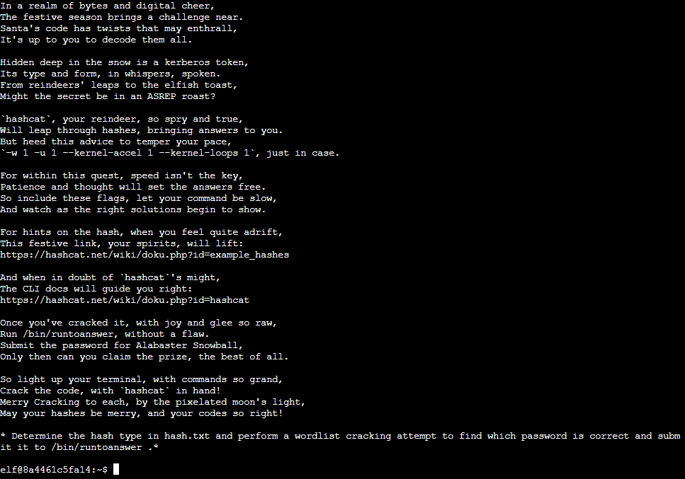
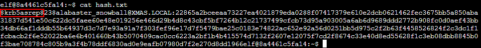
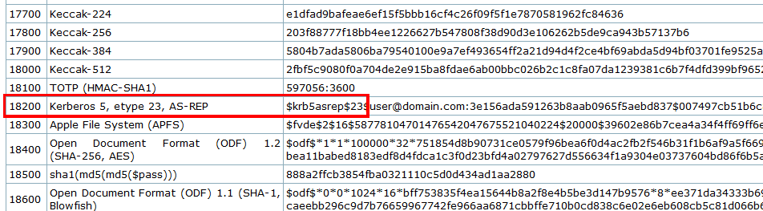
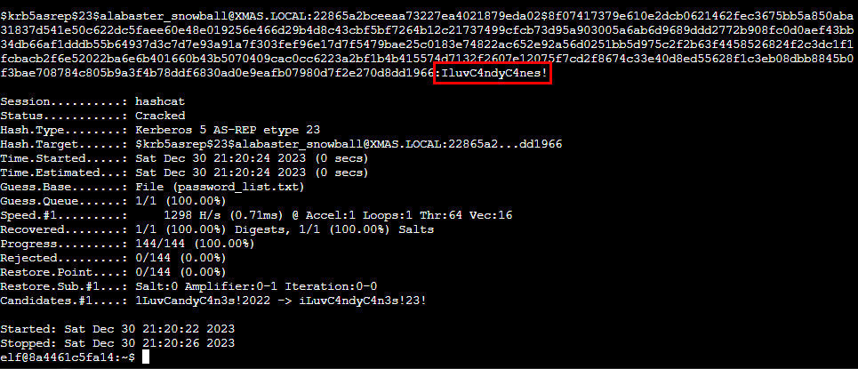

# Hashcat

**Difficulty**: :fontawesome-solid-star::fontawesome-solid-star::fontawesome-regular-star::fontawesome-regular-star::fontawesome-regular-star:<br/>
**Direct link**: [Hashcat Terminal](https://hhc23-wetty.holidayhackchallenge.com/?&challenge=hashcat&id=314f7daa-8eb4-4656-aa31-b4f742163739)

## Objective

!!! question "Request"
    Eve Snowshoes is trying to recover a password. Head to the Island of Misfit Toys and take a crack at it!

??? quote "Eve Snowshoes"
    I'm Eve Snowshoes, resident tech hobbyist, and I hear Alabaster is in quite the predicament.<br>
    Our dear Alabaster forgot his password. He's been racking his jingle bells of memory with no luck.<br>
    I've been trying to handle this password recovery thing parallel to this hashcat business myself but it seems like I am missing some tricks.<br>
    So, what do you say, chief, ready to get your hands on some hashcat action and help a distraught elf out?

## Solution

First, read the instructions.



To find what type of hash in ```hash.txt```, use ```cat hash.txt``` to print its contents.



The hashcat wiki has a list of [examble hashes](https://hashcat.net/wiki/doku.php?id=example_hashes) that can be searched through to find a similar one.



There is also a password list in the home directory that will help speed up the proccess. Use the command ```hashcat --force -w 1 -u 1 --kernel-accel 1 --kernel-loops 1 -m 18200 hash.txt password_list.txt``` to crack the password.



When the program finishes, you can close the terminal and submit the password in the objective.

!!! success "Answer"
    IluvC4ndyC4nes!

## Response

!!! quote "Eve Snowshoes"
    Aha! Success! Alabaster will undoubtedly be grateful for our assistance.<br>
    Onward to our next adventure, comrade! Feel free to explore this whimsical world of gears and steam!
