# KQL Kraken Hunt

**Difficulty**: :fontawesome-solid-star::fontawesome-solid-star::fontawesome-regular-star::fontawesome-regular-star::fontawesome-regular-star:<br/>
**Direct link**: [Objective 1 terminal](https://.../)

## Objective

!!! question "Request"
    Use Azure Data Explorer to [uncover misdeeds](https://detective.kusto.io/sans2023) in Santa's IT enterprise. Go to Film Noir Island and talk to Tangle Coalbox for more information.

??? quote "Tangle Coalbox"
    Greetings, rookie. Tangle Coalbox of Kusto Detective Agency here.<br>
    I've got a network infection case on Film Noir Island that needs your expertise.<br>
    Seems like someone clicked a phishing link within a client's organization, and trouble's brewing.<br>
    I'm swamped with cases, so I need an extra pair of hands. You up for the challenge?<br>
    You'll be utilizing the Azure Data Explorer and those KQL skills of yours to investigate this incident.<br>
    Before you start, you'll need to [create a free cluster](https://dataexplorer.azure.com/freecluster).<br>
    Keep your eyes peeled for suspicious activity, IP addresses, and patterns that'll help us crack this case wide open.<br>
    Remember, kid, time is of the essence. The sooner we can resolve this issue, the better.<br>
    If you run into any problems, just give me a holler, I've got your back.<br>
    Good hunting, and let's bring this cyber criminal to justice.<br>
    Once you've got the intel we need, report back and we'll plan our next move. Stay sharp, rookie.

## Hints

??? tip "File Creation"
    Looking for a file that was created on a victim system? Don't forget the _FileCreationEvents_ table.

??? tip "KQL Tutorial"
    Once you get into the [Kusto trainer](https://detective.kusto.io/sans2023), click the blue _Train me for the case_ button to get familiar with KQL.

??? tip "Outbound Connections"
    Do you need to find something that happened via a process? Pay attention to the _ProcessEvents_ table!

## Solution

Create a [free cluster](https://dataexplorer.azure.com/freecluster) and copy the url.

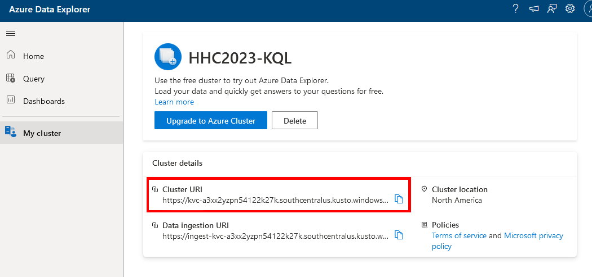

To start, click the login button on the kusto website and paste your clister url.

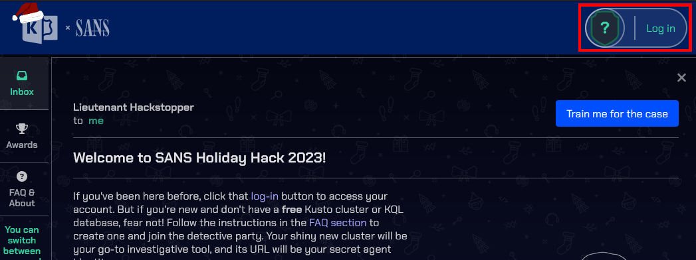

### Onboaring

To complete the onboaring, we need the number of Craftperson Elfs that are working from laptops. To find this, go to the ```Azure Data Explorer``` and click on the ```Query``` tab. Then run the following to extract the information.<br>

```
Employees // Employees table
| where hostname has "laptop" // hostname of employee must have laptop in it
| where role =~ "Craftsperson Elf" // role of employee must be "Craftsperson Elf"
| count // get the number of matches
```

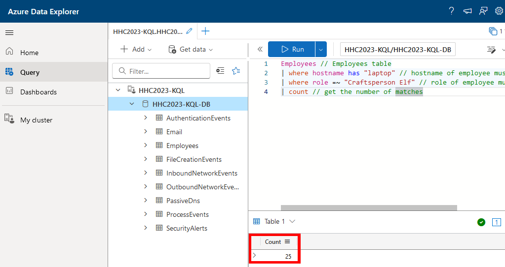

Submit the answer and read the instructions for Case 1.

### Case 1

We need to find the email of the employee who received the phishing email, the email address that was used to send the email, and the subject line of the email.
To find the email run the following.

```
Email // Email table
| where link == "http://madelvesnorthpole.org/published/search/MonthlyInvoiceForReindeerFood.docx" // email with a link to the malicious website
```

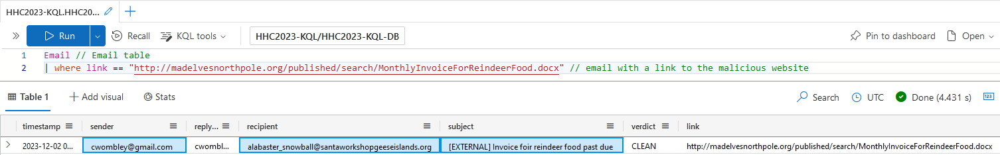

From this we can see that the targeted employee is ```alabaster_snowball@santaworkshopgeeseislands.org```, the sender's email is ```cwombley@gmail.com```, and the subject is ```[EXTERNAL] Invoice foir reindeer food past due```.

### Case 2

For Case 2, we need to find the role of the victim, the hostname of the victim's machine, and the source IP linked to the victim.

```
Employees // Employees table
| where email_addr == "alabaster_snowball@santaworkshopgeeseislands.org" // filter employees with email
```

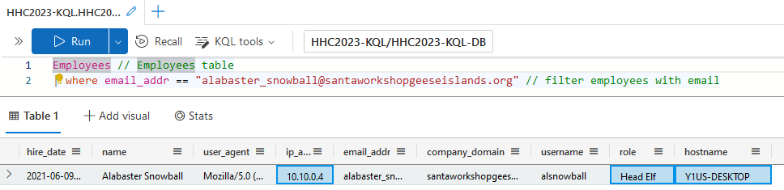

It seems that Alabaster Snowball was the victim. His role is ```Head Elf```, his hostname is ```Y1US-DESKTOP``` and his ip address is ```10.10.0.4```.

### Case 3

Case 3 requires the time that Alabaster clicked the malicious link and the malicious file that was created on his machine.

To find the first requirement, run the following.

```
OutboundNetworkEvents // OutboundNetworkEvents table
| where url == "http://madelvesnorthpole.org/published/search/MonthlyInvoiceForReindeerFood.docx" // url of requested website
```

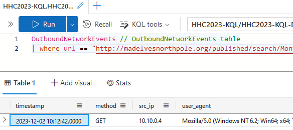

The exact time Alabaster clicked the link is ```2023-12-02T10:12:42Z```.<br>
The second requirement can be found with the following query.

```
FileCreationEvents // FileCreationEvents table
| where timestamp between (todatetime("2023-12-02T10:12:42Z") .. todatetime("2023-12-02T10:15:00Z")) // between the time that the link was clicked and some a few minutes later
| where hostname =~ "Y1US-DESKTOP" // on Alabaster's machine
```

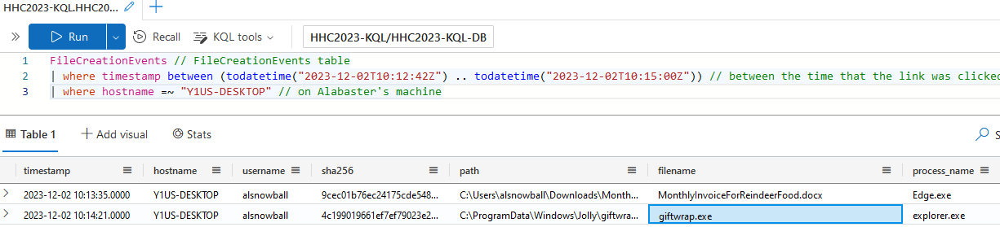

A malicious executable called ```giftwrap.exe``` seems to have been created shortly after the link was clicked.

### Case 4

A reverse tunnel connection was made with the compromised machine. We need the IP that this connection was forwarded to, the timestamp of when the attacker enumerated network shares, and the hostname that the attacker moved laterally to.<br>
All three of these can be found with the same query.

```
ProcessEvents // ProcessEvents table
| where timestamp between (todatetime("2023-12-02T10:12:42Z") .. todatetime("2023-12-30T18:00:00Z")) // between the time that the link was clicked and 28 days later
| where hostname =~ "Y1US-DESKTOP" // on Alabaster's machine
| where parent_process_name =~ "cmd.exe" or parent_process_name =~ "powershell.exe" // from the command promp or powershell
```

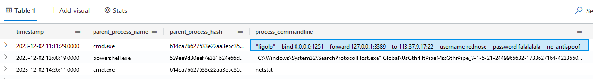

The IP that we need can be found at the very top of the query response: ```113.37.9.17```.

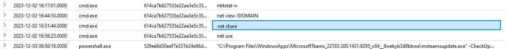

The timestamp of the network enumeration can be found slightly farther down: ```2023-12-02T16:51:44Z```.

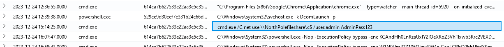

The hostname that the attacker moved to is near the bottom: ```NorthPolefileshare```.

### Case 5

The attacker executed powershell scripts on Alabaster's machine. We need to find when the first one was executed, the name of the file that was copied from the fileshare, and what domain the attacker exfiltrated data to.<br>
The powershell scripts are at the bottom of the previous query.

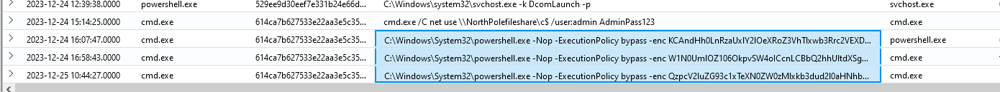

The first script was executed at ```2023-12-24T16:07:47Z```.<br>
The file that was copied can be found by decoding the base64 and reversing the text.

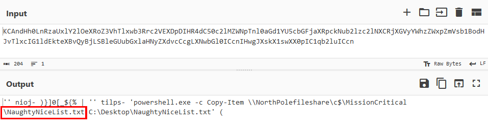

The name of the copied file is ```NaughtyNiceList.txt```.<br>
The domain that the data was sent to can be found in the next base64 encoding.


Next, copy the numbers and find their ASCII values.

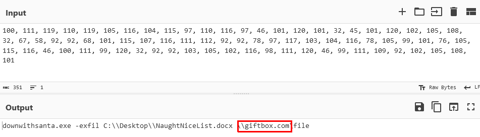

The domain is ```giftbox.com```.

### Case 6

Finally, we need to find the name of the executable that the attacker used in the final command and the command line flag that was used along side it.<br>
Simply decoding the base64 will do this time.

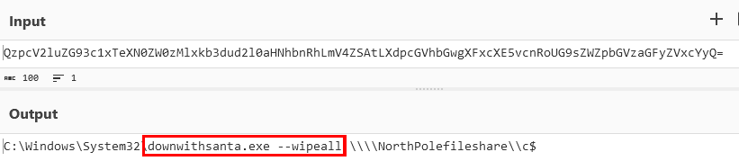

The executable is ```downwithsanta.exe``` and it was used with the flag ```--wipeall```.

!!! success "Answer"
    Beware the Cube that Wombles

## Response

!!! quote "Tangle Coalbox"
    I had my doubts, but you've proven your worth.<br>
    That phishing scheme won't trouble our client's organization anymore, thanks to your keen eye and investigatory prowess.<br>
    So long, Gumshoe, and be careful out there.
