# Linux 101

**Difficulty**: :fontawesome-solid-star::fontawesome-regular-star::fontawesome-regular-star::fontawesome-regular-star::fontawesome-regular-star:<br/>
**Direct link**: [Linux 101 Terminal](https://hhc23-wetty.holidayhackchallenge.com/?&challenge=linux101)

## Objective

!!! question "Request"
    Visit Ginger Breddie in Santa's Shack on Christmas Island to help him with some basic Linux tasks. It's in the southwest corner of Frosty's Beach.

??? quote "Ginger Breddie"
    Hey, welcome to Santa's Surf Shack on tropical Christmas Island! I'm just hanging ten here, taking it easy while brushing up on my Linux skills.<br>
    You ever tried getting into Linux? It's a super cool way to play around with computers.<br>
    Can you believe ChatNPT suggested this trip to the Geese Islands this year? I'm so thrilled!<br>
    Kudos to ChatNPT, eh? The sunshine, the waves, and my surfboard – simply loving it!<br>
    So, what do you have planned? Care to join me in a Linux session?

## Solution

Open the terminal and follow the instructions.

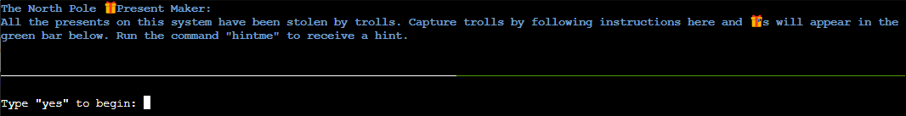

### Part 1

Read the instructions then type ```yes```.

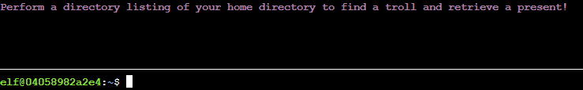

### Part 2

List directories using the ```ls``` command.

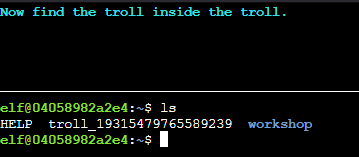

### Part 3

Read the contents of the troll file by using ```cat troll_19315479765589239```.

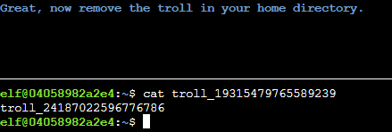

### Part 4

Remove the troll file by using ```rm troll_19315479765589239```.

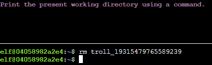

### Part 5

Print the present working directory by using the ```pwd``` command.

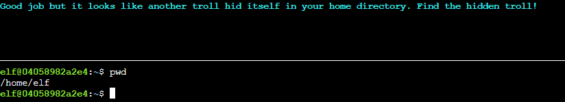

### Part 6

List all directories with ```ls -a```.

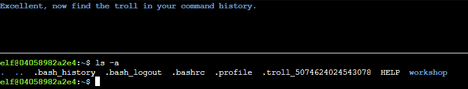

### Part 7

Find the troll in the command history with the ```history``` command.

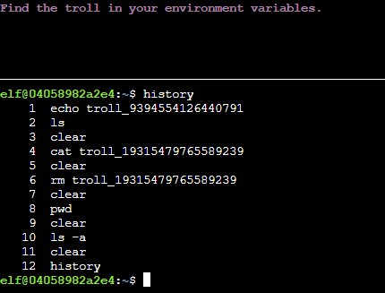

### Part 8

List the environment variables with the ```env``` command.

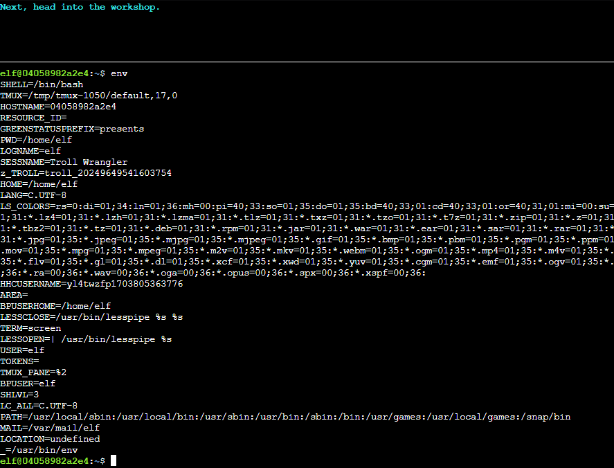

### Part 9

Go into the workshop with ```cd workshop/```.

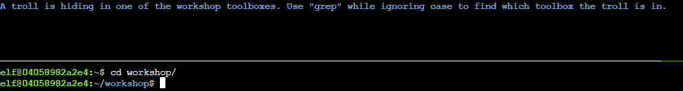

### Part 10

Find the troll in the files by using ```grep -i troll *```.

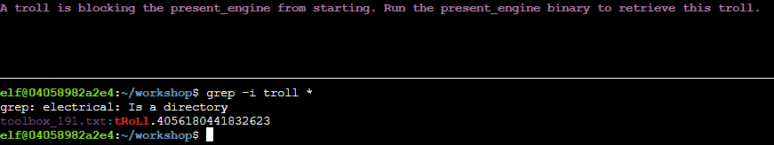

### Part 11

Make the present engine executable with ```chmod 775 present_engine``` then run it with ```./present_engine```.

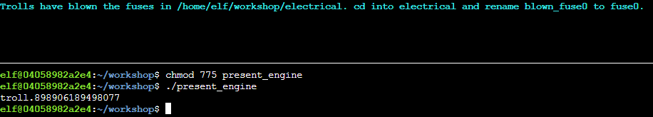

### Part 12

Go into electrical with ```cd electrical/``` then rename blown_fuse0 to fuse0 with ```mv blown_fuse0 fuse0```.

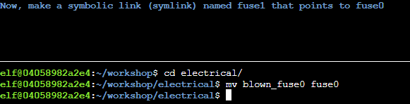

### Part 13

Make a symlink to fuse0 with ```ln -s fuse0 fuse1```.

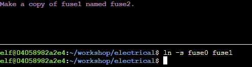

### Part 14

Copy fuse1 with ```cp fuse1 fuse2```.

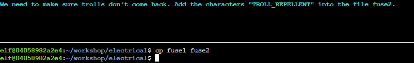

### Part 15

Add ```TROLL_REPELLENT``` to the end of fuse2 with ```cat >> fuse2```.

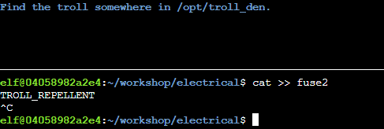

### Part 16

Go to the troll_den by using ```cd /opt/troll_den/``` then use ```find ./ -iname '*troll*'``` to find the troll in the troll_den.

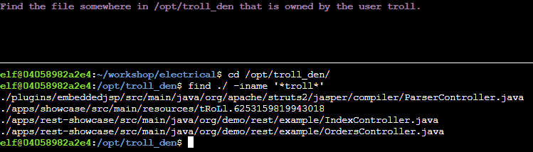

### Part 17

Use ```find ./ -user troll``` to find the file owned by troll.

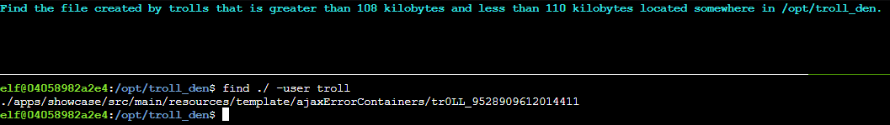

### Part 18

Use ```find ./ -size +108k -size -110k``` to find the correctly sized file.

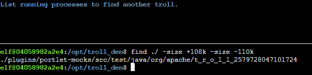

### Part 19

Use ```ps -e``` to list all the running processes.

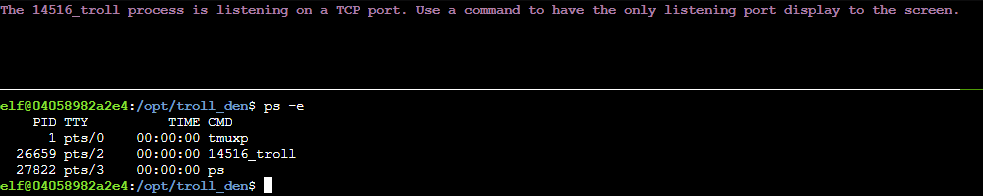

### Part 20

Use ```netstat -napt``` to list open ports.

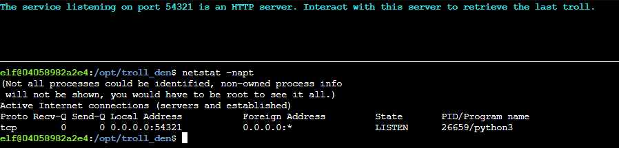

### Part 21

Use ```curl 0.0.0.0:54321``` to interact with the open http port.

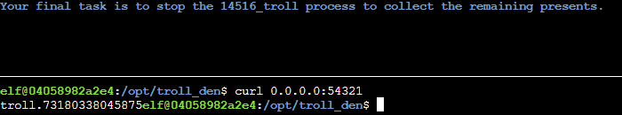

### Part 22

Use ```kill``` to stop the troll process with the process id shown in [part 19](#part-19).

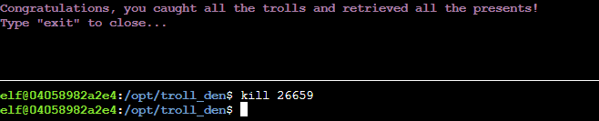

!!! success "Answer"
    Follow the instructions in the terminal.

## Response

!!! quote "Ginger Breddie"
    Wow, if your surfing skills are as good as your Linux skills, you could be winning competitions!
