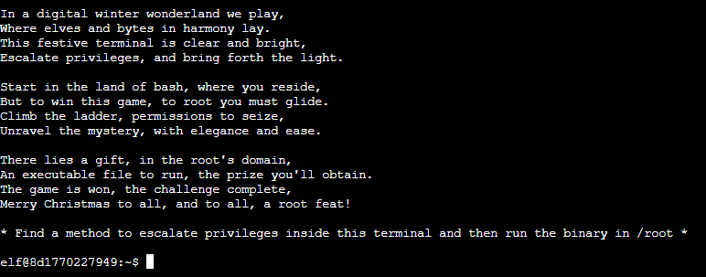
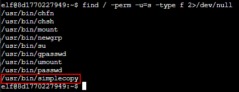
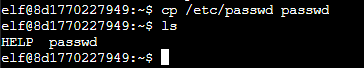
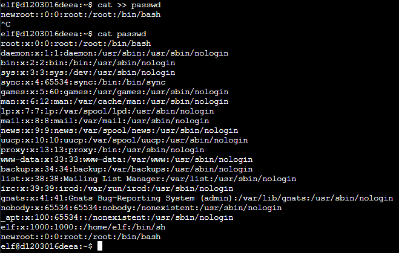
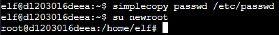
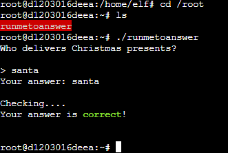

# Linux PrivEsc

**Difficulty**: :fontawesome-solid-star::fontawesome-solid-star::fontawesome-solid-star::fontawesome-regular-star::fontawesome-regular-star:<br/>
**Direct link**: [Linux PrivEsc Terminal](https://hhc23-wetty.holidayhackchallenge.com/?&challenge=linuxpriv&id=cd1fcfef-de12-45b4-b758-cf977af738e4)

## Objective

!!! question "Request"
    Rosemold is in Ostrich Saloon on the Island of Misfit Toys. Give her a hand with escalation for a tip about hidden islands.

??? quote "Rose Mold"
    What am I doing in this saloon? The better question is: what planet are you from?<br>
    Yes, I’m a troll from the Planet Frost. I decided to stay on Earth after Holiday Hack 2021 and live among the elves because I made such dear friends here.<br>
    Whatever. Do you know much about privilege escalation techniques on Linux?<br>
    You're asking why? How about I'll tell you why after you help me.<br>
    And you might have to use that big brain of yours to get creative, bub.

## Hints

??? tip "Linux Privilege Escalation Techniques"
    There's [various ways](https://payatu.com/blog/a-guide-to-linux-privilege-escalation/) to escalate privileges on a Linux system.

??? tip "Linux Command Injection"
    Use the privileged binary to overwriting a file to escalate privileges could be a solution, but there's an easier method if you pass it a crafty argument.

## Solution

First, read the instructions.



The goal is to find a vulnerability that allows you to obtain root privileges. To acheive this, start by running the command ```find / -perm -u=s -type f 2>/dev/null```.



```/usr/bin/simplecopy``` can be used to copy files. Since it is SUID executable, it will have the privileges of root but can be executed by any user. This means it is possible to copy files such as ```/etc/passwd```.<br>
First, copy the file to the home directory with ```cp /etc/passwd passwd```.



Next, add a new login to the file with ```cat >> passwd```. This command waits for user input to append to the file. To be able to log in as root, follow the format ```<username>::0:0:root:/root:/bin/bash``` where ```<username>``` is the username you will use to log in.



Now copy ```passwd``` back to ```/etc/passwd``` with ```simplecopy```: ```simplecopy passwd /etc/passwd```.<br>
Next, do ```su <username>``` to log in as the new user.



Finally, go to the root directory (```cd /root/```) and run the executable.



!!! success "Answer"
    santa

## Response

!!! quote "Rose Mold"
    Yup, I knew you knew. You just have that vibe.<br>
    To answer your question of why from earlier... Nunya!<br>
    But, I will tell you something better, about some information I... found.<br>
    There's a hidden, uncharted area somewhere along the coast of this island, and there may be more around the other islands.<br>
    The area is supposed to have something on it that's totes worth, but I hear all the bad vibe toys chill there.<br>
    That's all I got. K byyeeeee.<br>
    Ugh... n00bs...
