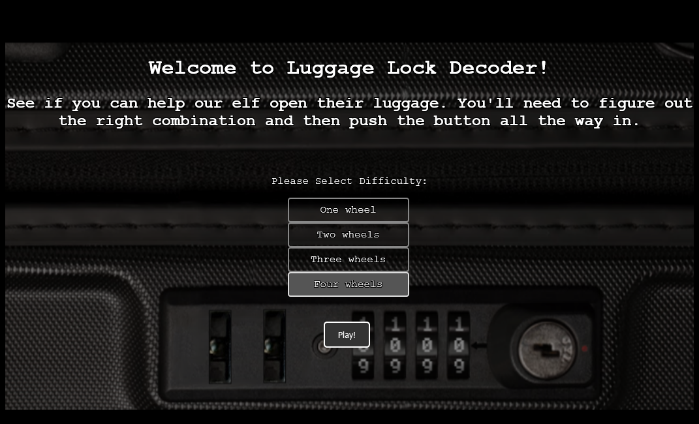
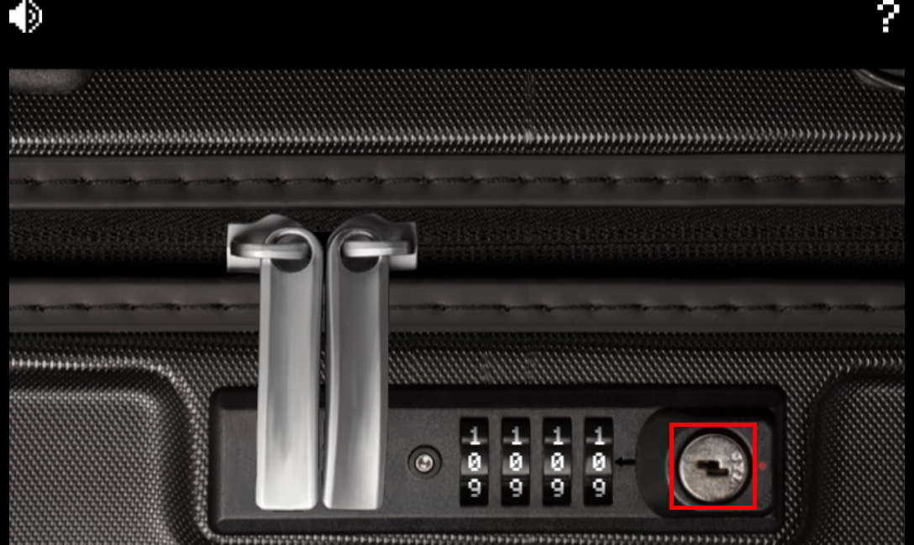
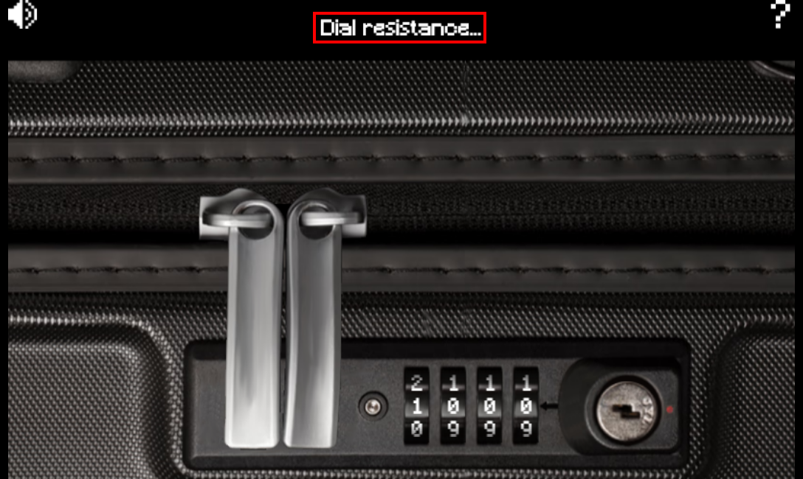
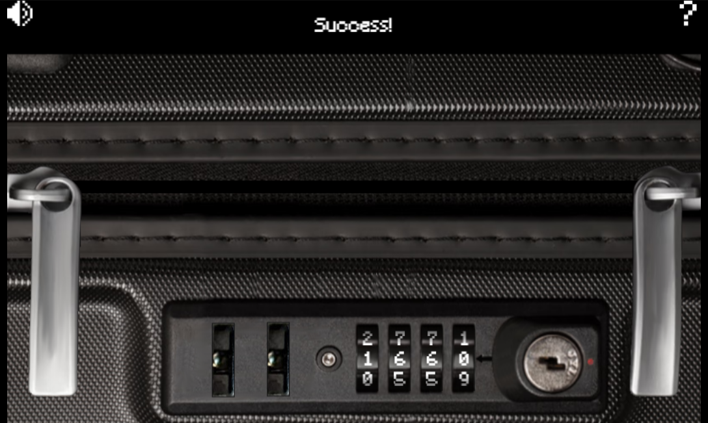

# Luggage Lock

**Difficulty**: :fontawesome-solid-star::fontawesome-regular-star::fontawesome-regular-star::fontawesome-regular-star::fontawesome-regular-star: 
**Direct link**: [Luggage Lock Terminal](https://lockdecode.com/?&challenge=lockdecode&id=576549b3-7887-4d58-9897-254b509ea7fa)

## Objective

!!! question "Request"
    Help Garland Candlesticks on the Island of Misfit Toys get back into his luggage by finding the correct position for all four dials

??? quote "Garland Candlesticks"
    Hey there, I'm Garland Candlesticks! I could really use your help with something. 
    You see, I have this important pamphlet in my luggage, but I just can't remember the combination to open it! 
    Chris Elgee gave a talk recently that might help me with this problem. Did you attend that? 
    I seem to recall Chris mentioning a technique to figure out the combinations... 
    I have faith in you! We'll get that luggage open in no time. 
    This pamphlet is crucial for me, so I can't thank you enough for your assistance. 
    Once we retrieve it, I promise to treat you to a frosty snack on me!

## Hints

??? tip "Lock Talk"
    Check out Chris Elgee's [talk](https://youtu.be/ycM1hBSEyog) regarding his and his wife's luggage.  Sounds weird but interesting!

## Solution

Start by selecting the "Four wheels" difficulty then clicking "Play!"

Next push the button 3 or 4 steps down.

Rotate the dials with the ++"q"++, ++"w"++, ++"e"++, and ++"r"++ keys. When the dial resists, take note of the number. Whichever number seems to resists the most is probably the correct number.

After all the dials seem correct, push the button all the way down and the lock should open.

!!! success "Answer"
    Pick the luggage lock.

## Response

!!! quote "Garland Candlesticks"
    Wow, you did it! I knew you could crack the code. Thank you so much!
