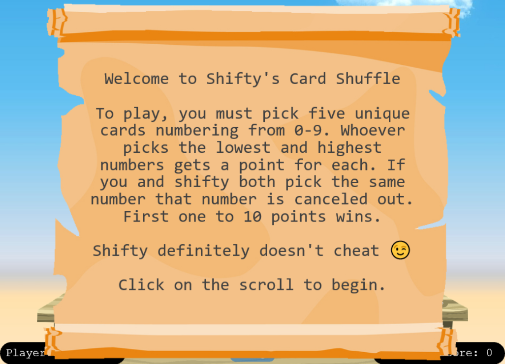
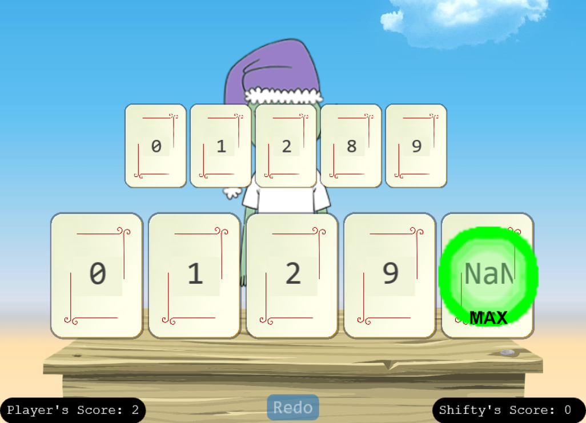

# Na'an

**Difficulty**: :fontawesome-solid-star::fontawesome-solid-star::fontawesome-regular-star::fontawesome-regular-star::fontawesome-regular-star:<br/>
**Direct link**: [Na'an Terminal](https://nannannannannannan.com/?&challenge=naan&id=e7cd0ed6-39ec-49e4-ab47-0f53f7fcb816)

## Objective

!!! question "Request"
    Shifty McShuffles is hustling cards on Film Noir Island. Outwit that meddling elf and win!
    
??? quote "Shifty McShuffles"
    Hey there, stranger! Fancy a game of cards? Luck's on your side today, I can feel it.<br>
    Step right up, test your wit! These cards could be your ticket to fortune.<br>
    Trust me, I've got a good eye for winners, and you've got the look of luck about you.<br>
    Plus, I'd wager you've never played this game before, as this isn't any ordinary deck of cards. It's made with [Python](https://www.tenable.com/blog/python-nan-injection).<br>
    The name of the game is to bamboozle the dealer.<br>
    So whad'ya think? Are you clever enough?

## Hints

??? tip "The Upper Hand"
    Shifty said his deck of cards is made with Python. Surely there's a [weakness](https://www.tenable.com/blog/python-nan-injection) to give you the upper hand in his game.

??? tip "Stump the Chump"
    Try to outsmart Shifty by sending him an error he may not understand.

## Solution

First, read the instructions.



To win a game, pick ```0``` as the lowest and ```NaN``` as the highest. You must also pick ```9```, but the other two cards don't matter.



Each game will give you 2 points. To complete the challenge, repeat this proccess 5 times.

!!! success "Answer"
    NaN

## Response

!!! quote "Shifty McShuffles"
    Well, you sure are more clever than most of the tourists that show up here.<br>
    I couldn't swindle ya, but don't go telling everyone how you beat me!<br>
    An elf's gotta put food on the table somehow, and I'm doing the best I can with what I got.
