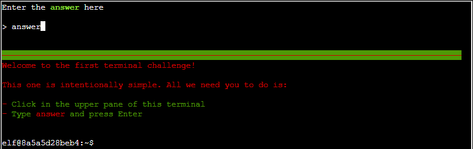

# Holiday Hack Orientation

**Difficulty**: :fontawesome-solid-star::fontawesome-regular-star::fontawesome-regular-star::fontawesome-regular-star::fontawesome-regular-star: 
**Direct link**: [Orientation Terminal](https://hhc23-wetty.holidayhackchallenge.com/?&challenge=orientation&id=51f39304-c9a3-490d-b618-0d0f7cae1193)

## Objective

!!! question "Request"
    Talk to Jingle Ringford on Christmas Island and get your bearings at Geese Islands

??? quote "Jingle Ringford"
    Welcome to the Geese Islands and the 2023 SANS Holiday Hack Challenge! 
    I'm Jingle Ringford, one of Santa's many elves. 
    Santa asked me to meet you here and give you a short orientation to this festive event. 
    Before you head back to your boat, I'll ask you to accomplish a few simple tasks.

## Solution

Talk to Jingle Ringford and follow his instructions.

!!! quote "Jingle Ringford"
    First things first, here's your badge! It's that starfish in the middle of your avatar. 
    Great - now you're official! 
    Click on the badge on your avatar. That's where you will see your Objectives, Hints, and Conversations for the Holiday Hack Challenge. 
    We've also got handy links to some awesome talks and more there for you!

Click on the starfish badge on your avatar.

!!! quote "Jingle Ringford"
    Fantastic! 
    OK, one last thing. Click on the **Cranberry Pi Terminal** and follow the on-screen instructions.

Click on the terminal and submit "answer" in the top pane.

After hitting enter, the terminal should close automatically.

!!! success "Answer"
    Dock your boat and follow Jingle Ringford's instructions.

## Response

!!! quote "Jingle Ringford"
    Perfect! Your orientation is now complete! 
    Head back to your boat or click on the anchor icon on the left of the screen to set sail for Frosty's Beach where Santa's waiting for you. I've updated your boat's compass to guide the way. 
    As you sail to each island, talk to the goose of that island to receive a colorful lei festooning the masts on your ship. 
    Safe travels my friend and remember, relax, enjoy the sun, and most importantly, have FUN!
