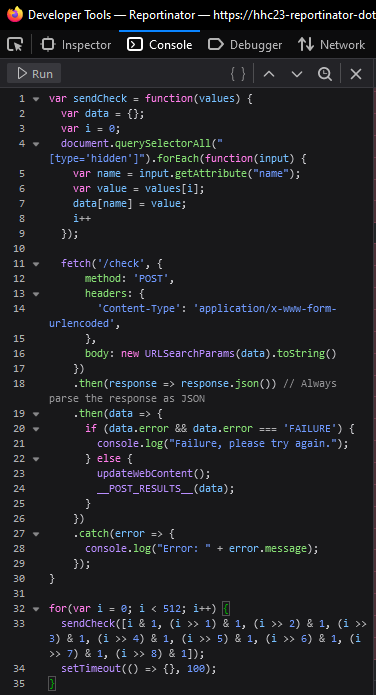
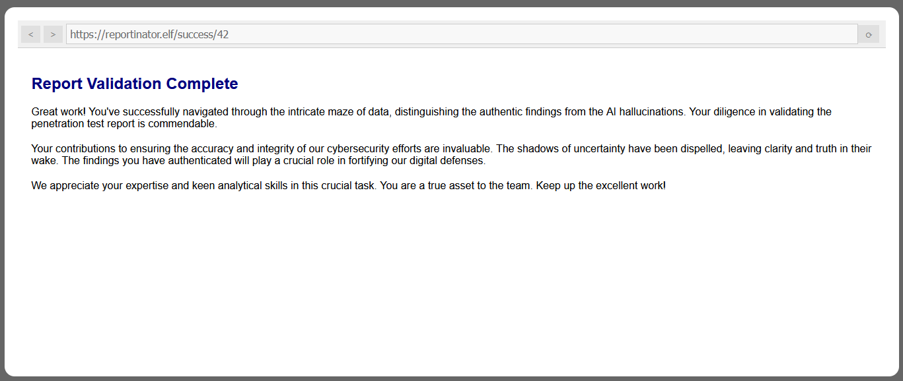

# Reportinator

**Difficulty**: :fontawesome-solid-star::fontawesome-solid-star::fontawesome-regular-star::fontawesome-regular-star::fontawesome-regular-star:<br/>
**Direct link**: [Reportinator Terminal](https://hhc23-reportinator-dot-holidayhack2023.ue.r.appspot.com/?&challenge=reportinator)

## Objective

!!! question "Request"
    Noel Boetie used ChatNPT to write a pentest report. Go to Christmas Island and help him clean it up.

??? quote "Noel Boetie"
    Hey there, Noel Boetie speaking! I recently tried using ChatNPT to generate my penetration testing report.<br>
    It's a pretty nifty tool, but there are a few issues in the output that I've noticed.<br>
    I need some guidance in finding any errors in the way it generated the content, especially those odd hallucinations in the LLM output.<br>
    I know it's not perfect, but I'd really appreciate the extra eyes on this one.<br>
    Some of the issues might be subtle, so don't be afraid to dig deep and ask for further clarification if you're unsure.<br>
    I've heard that you folks are experts about LLM outputs and their common issues, so I trust you can help me with this.<br>
    Your input will be invaluable to me, so please feel free to share any insights or findings you may have.<br>
    I'm looking forward to working with you all and improving the quality of the ChatNPT-generated penetration testing report.<br>
    Thanks in advance for your help! I truly appreciate it! Let's make this report the best it can be!

## Solution

For this challenge you have to figure out which reports are hallucinations and which are real. This can be hard to do, so instead, you can paste this into the console and set the context to ```Reportinator```.

```javascript
var sendCheck = function(values) {
  var data = {};
  var i = 0;
  document.querySelectorAll("[type='hidden']").forEach(function(input) {
    var name = input.getAttribute("name");
    var value = values[i];
    data[name] = value;
    i++
  });

  fetch('/check', {
      method: 'POST',
      headers: {
        'Content-Type': 'application/x-www-form-urlencoded',
      },
      body: new URLSearchParams(data).toString()
    })
    .then(response => response.json()) // Always parse the response as JSON
    .then(data => {
      if (data.error && data.error === 'FAILURE') {
        console.log("Failure, please try again.");
      } else {
        updateWebContent();
        __POST_RESULTS__(data);
      }
    })
    .catch(error => {
      console.log("Error: " + error.message);
    });
}

for(var i = 0; i < 512; i++) {
  sendCheck([i & 1, (i >> 1) & 1, (i >> 2) & 1, (i >> 3) & 1, (i >> 4) & 1, (i >> 5) & 1, (i >> 6) & 1, (i >> 7) & 1, (i >> 8) & 1]);
  setTimeout(() => {}, 100);
}
```



After a few seconds, the challenge is complete.



!!! success "Answer"
    Figure out which sections are AI hallucinations.

## Response

!!! quote "Noel Boetie"
    Great job on completing that challenge! Ever thought about how your newfound skills might come into play later on? Keep that mind sharp, and remember, today's victories are tomorrow's strategies! 
