# The Captain's Comms

**Difficulty**: :fontawesome-solid-star::fontawesome-solid-star::fontawesome-solid-star::fontawesome-solid-star::fontawesome-solid-star:<br/>
**Direct link**: [Captain's Comms Terminal](https://captainscomms.com/?&challenge=capcom&id=c23e620e-c8e7-40ed-89d2-8fafc93ff129)

## Objective

!!! question "Request"
    Speak with Chimney Scissorsticks on Steampunk Island about the interesting things the captain is hearing on his new Software Defined Radio. You'll need to assume the **GeeseIslandsSuperChiefCommunicationsOfficer** role.

??? quote "Chimney Scissorsticks"
    Ahoy there, I'm Chimney Scissorsticks!<br>
    You may have noticed some mischief-makers planning to stir up trouble ashore.<br>
    They've made many radio broadcasts which the captain has been monitoring with his new software defined radio (SDR).<br>
    The new SDR uses some fancy JWT technology to control access.<br>
    The captain has a knack for shortening words, some sorta abbreviation trick.<br>
    Not familiar with JWT values? No worries; just think of it as a clue-solving game.<br>
    I've seen that the Captain likes to carry his journal with him wherever he goes.<br>
    If only I could find the planned "go-date", "go-time", and radio frequency they plan to use.<br>
    Remember, the captain's abbreviations are your guiding light through this mystery!<br>
    Once we find a JWT value, these villains won't stand a chance.<br>
    The closer we are, the sooner we'll be thwarting their pesky plans!<br>
    We need to recreate an administrative JWT value to successfully transmit a message.<br>
    Good luck, matey! I've no doubts about your cleverness in cracking this conundrum!

## Hints

??? tip "Comms Abbreviations"
    I hear the Captain likes to abbreviate words in his filenames; shortening some words to just 1,2,3, or 4 letters.

??? tip "Comms Web Interception Proxies"
    Web Interception proxies like [Burp](https://portswigger.net/burp) and [Zap](https://www.zaproxy.org) make web sites fun!

??? tip "Comms Private Key"
    Find a private key, update an existing JWT!

??? tip "Comms JWT Intro"
    A great introduction to JSON Web Tokens is available from [Auth0](https://jwt.io/introduction).

??? tip "Comms Journal"
    I've seen the Captain with [his Journal](https://elfhunt.org/static/images/captainsJournal.png) visiting Pixel Island! 

## Solution

For this challenge, you must assume the **GeeseIslandsSuperChiefCommunicationsOfficer** role. To do this, look around the shack by clicking on the areas with yellow outlines.

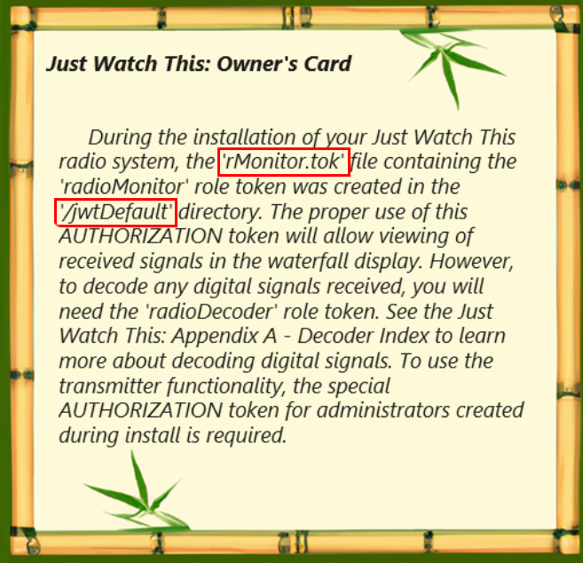

The owner's card mentions a "monitor token" file located at ```/jwtDefault/rMonitor.tok```. This file can be read by sending a request to the server with the current JWT token.

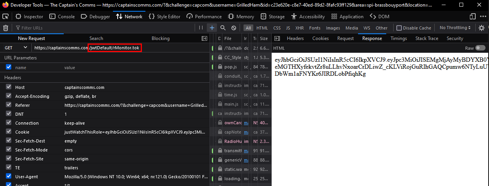

By replacing the cookie with this new token, you can access the SDR.

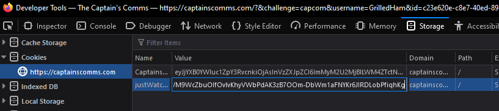

When you try to access more, you are shown the following message.


The decoder role is probably in the same folder and follows the same format as the monitor role. Checking ```/jwtDefault/rDecoder.tok``` using the monitor token confirms this.

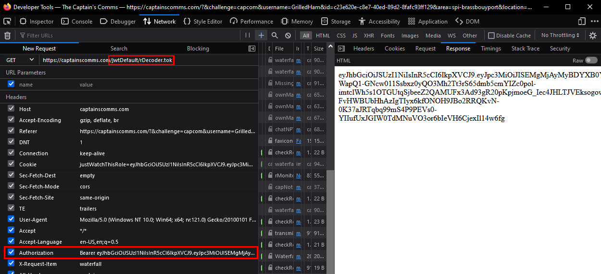

Replace the cookie again and you can access the radio signals.<br>
The first one gives you a folder which contains the Captain's raido private key.

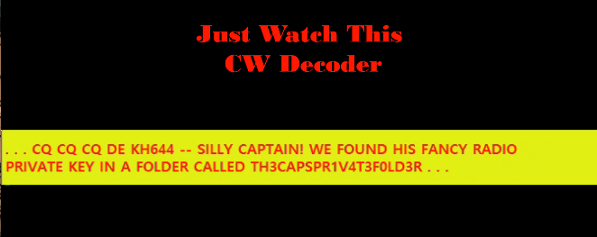

The second signal gives you a time and date. It is hidden between the {gong}s.

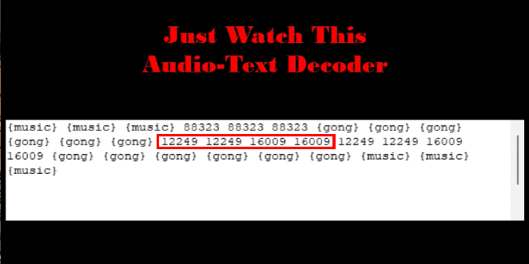

This is just the date repeated twice followed by the time repeated twice. Both numbers have an extra 9 added to the end of them.
```
12/24 16:00
```

The last signal gives you the frequency.

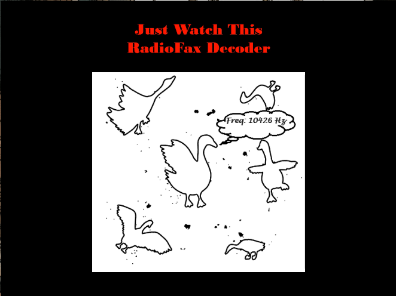

Before broadcasting, you still need the Captain's token.

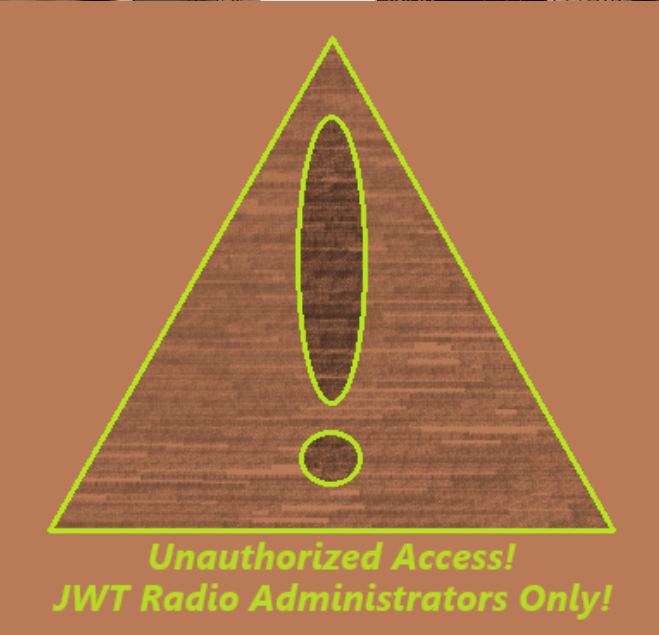

Looking in the Captain's To-Do list, you can see that he put the public key in a folder called ```keys``` and called the file ```capsPubKey.key```.

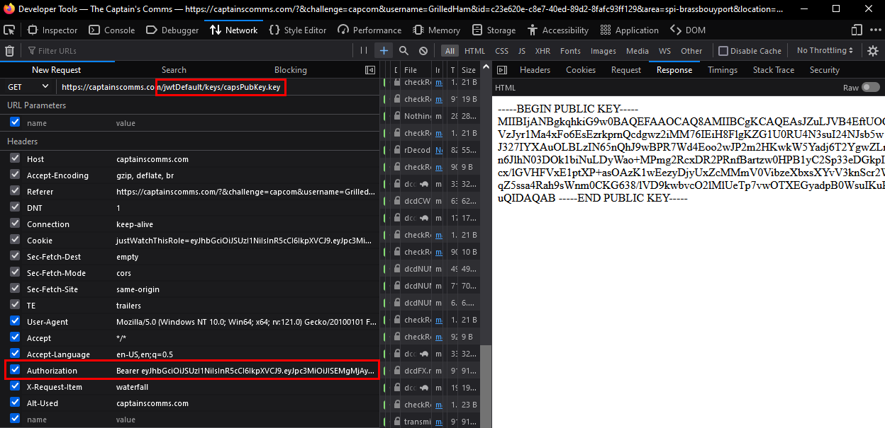

The first radio signal earlier showed that his private key is in the ```TH3CAPSPR1V4T3F0LD3R``` folder. It probably follows the same filename format.

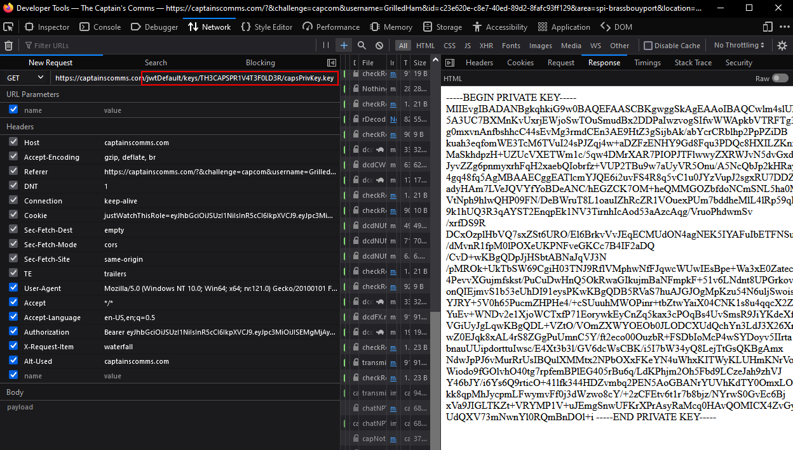

Now you can [create the correct JWT token](https://jwt.io/#debugger-io) once you find the correct role after completing the [Elf Hunt](./elf_hunt.md) challenge.

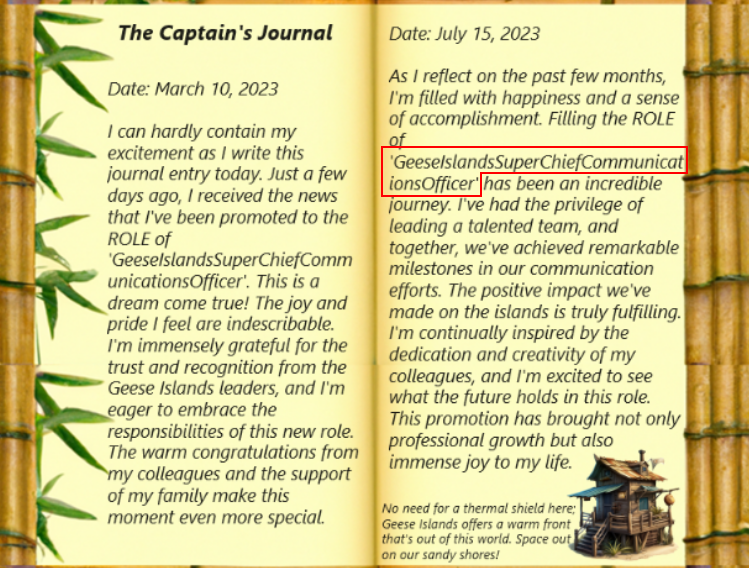

[Create the admin token](https://jwt.io/#debugger-io) and set the cookie back on the challenge website.

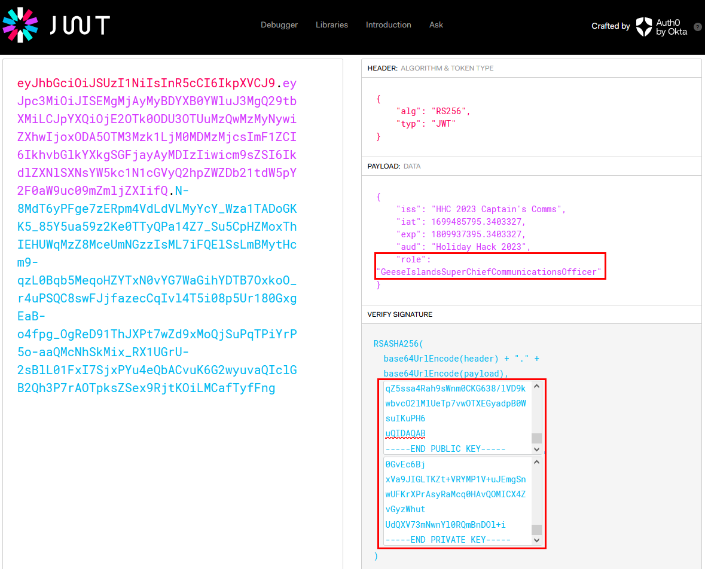

Finally, you can access the transmitter and input the frequency, go date, and go time. Make sure the go time is 4 hours earlier than what the attackers wanted.

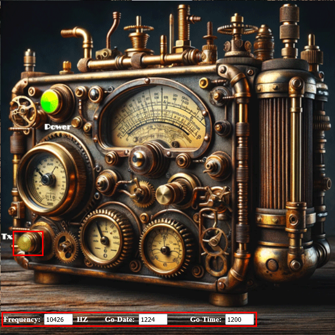

!!! success "Answer"
    10426Hz 12/24 12:00

## Response

!!! quote "Chimney Scissorsticks"
    Brilliant work! You've outsmarted those scoundrels with finesse!
